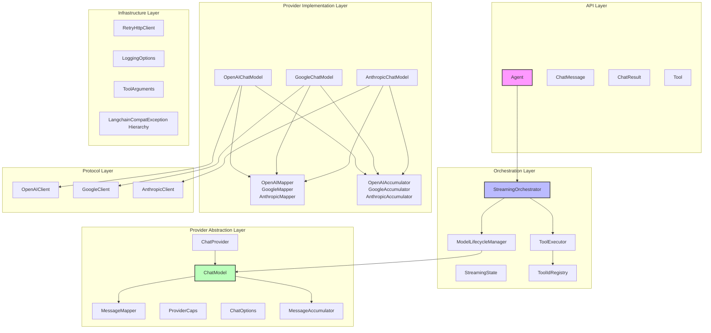
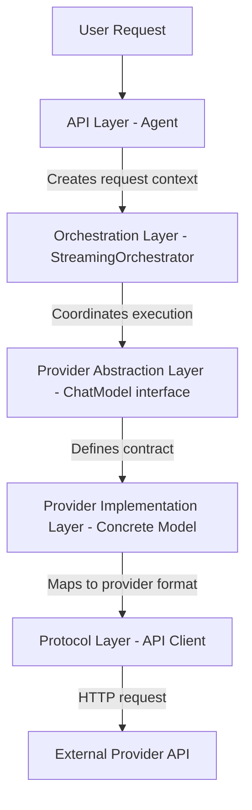
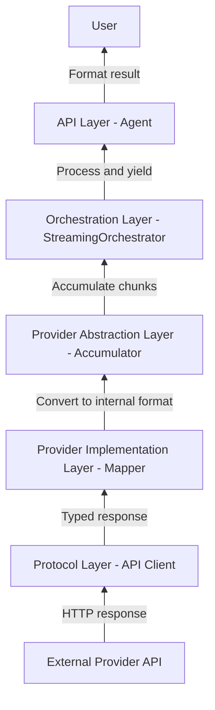
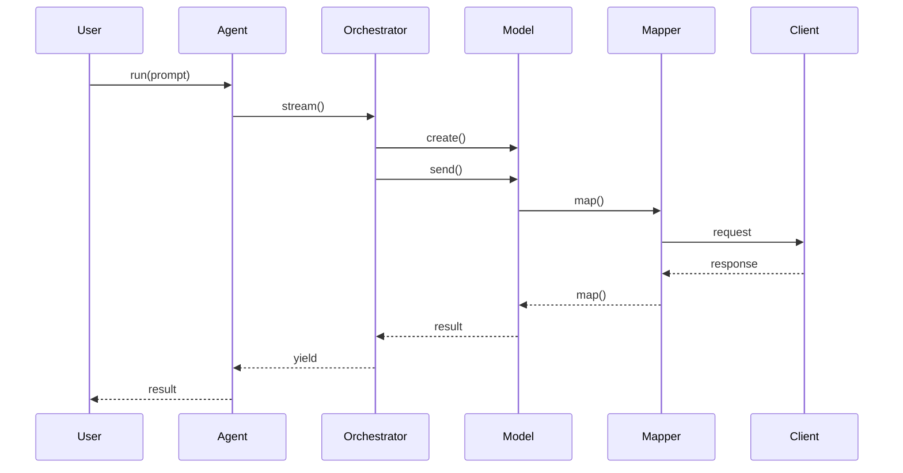
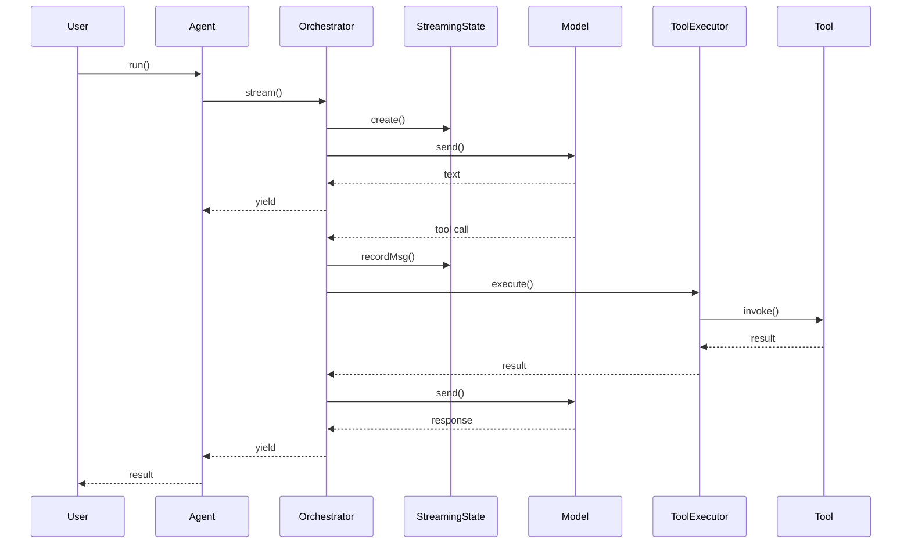

```mermaid
sequenceDiagram
    participant User
    participant Agent
    participant Orchestrator
    participant Model
    participant Provider
    
    User->>Agent: run()
    Agent->>Orchestrator: add return_result
    Agent->>Orchestrator: stream()
    Orchestrator->>Model: send()
    Model->>Provider: check native?
    alt Native support
        Model->>Provider: filter return_result
        Provider-->>Model: JSON
    else No native support
        Model->>Provider: request with tools
        Provider-->>Model: tool call
    end
    Model-->>Orchestrator: JSON
    Orchestrator-->>Agent: yield
    Agent-->>User: JSON
```

# Complete Agent, Model, and Mapper Refactoring Architecture

> **Note**: This document describes a historical refactoring. The ModelLifecycleManager component described here has since been removed in favor of direct model creation and disposal.

## Table of Contents
1. [Architectural Vision](#architectural-vision)
2. [Layer Responsibilities](#layer-responsibilities)
3. [Inter-Layer Communication](#inter-layer-communication)
4. [Component Inventory](#component-inventory)
5. [Key Flows and Sequence Diagrams](#key-flows-and-sequence-diagrams)
6. [Design Rationale](#design-rationale)
7. [Core Principles and Invariants](#core-principles-and-invariants)
8. [Phased Implementation Plan](#phased-implementation-plan)

## Architectural Vision

### Layered Architecture Diagram



## Layer Responsibilities

### API Layer (Public Interface)
**Purpose**: Provides the stable, user-facing API that maintains backward
compatibility.

**Key Responsibilities**:
- Expose simple, intuitive interfaces for end users
- Validate input parameters and provide clear error messages
- Maintain the existing public API contract
- Hide implementation complexity from users
- Handle initial request processing and final response formatting

**Components**:
- `Agent`: Main entry point for users, orchestrates all operations
- `ChatMessage`: Represents messages in conversations
- `ChatResult`: Encapsulates response data including usage and metadata
- `Tool`: Defines callable functions the AI can use

**Communication**:
- **Downward**: Delegates complex operations to Orchestration Layer
- **Upward**: Returns formatted results to users
- **Data Flow**: Accepts user input → passes to orchestration → receives results
  → formats for user

### Orchestration Layer (Business Logic)
**Purpose**: Manages complex workflows and coordinates between components.

**Key Responsibilities**:
- Handle streaming orchestration and state management
- Execute tools with proper error handling and context
- Manage model lifecycle (creation, configuration, disposal)
- Coordinate message flow and accumulation
- Implement retry and fallback strategies
- Track execution state across streaming operations

**Components**:
- `StreamingOrchestrator`: Manages the entire streaming workflow
- `ToolExecutor`: Handles tool invocation with structured error handling
- `ModelLifecycleManager`: Ensures proper resource management
- `StreamingState`: Tracks streaming context and message prefixing
- `ToolIdRegistry`: Centralizes tool ID generation and tracking

**Communication**:
- **Upward**: Receives requests from API Layer
- **Downward**: Uses Provider Abstraction Layer to interact with models
- **Lateral**: Components communicate through well-defined interfaces
- **Data Flow**: Receives user request → creates model → streams responses →
  executes tools → accumulates results

### Provider Abstraction Layer (Contracts)
**Purpose**: Defines abstract interfaces that all providers must implement.

**Key Responsibilities**:
- Define contracts for provider implementations
- Declare provider capabilities
- Provide base implementations for common patterns
- Enable provider-agnostic code in upper layers
- Define message transformation interfaces

**Components**:
- `ChatProvider`: Factory interface for creating models
- `ChatModel`: Abstract base class for all chat models
- `MessageMapper<TProvider>`: Contract for message conversion
- `MessageAccumulator`: Strategy interface for streaming accumulation
- `ProviderCaps`: Capability declaration system
- `ChatOptions`: Base class for provider-specific options

**Communication**:
- **Upward**: Implements interfaces used by Orchestration Layer
- **Downward**: Defines contracts implemented by Provider Implementation Layer
- **Data Flow**: Defines transformation contracts → implemented by providers →
  used by orchestration

### Provider Implementation Layer (Concrete Implementations)
**Purpose**: Contains provider-specific implementations of the abstraction
contracts.

**Key Responsibilities**:
- Implement provider-specific API communication
- Handle protocol-specific message formatting
- Manage streaming protocols (chunking, accumulation)
- Deal with provider quirks and edge cases
- Convert between internal and provider formats

**Components**:
- **Models**: `OpenAIChatModel`, `AnthropicChatModel`, `GoogleChatModel`,
  `OllamaChatModel`, `MistralChatModel`, `CohereChatModel`
- **Mappers**: `OpenAIMapper`, `AnthropicMapper`, `GoogleMapper`,
  `OllamaMapper`, `MistralMapper`, `CohereMapper`
- **Accumulators**: Provider-specific implementations of `MessageAccumulator`
- **Options**: Provider-specific option classes

**Communication**:
- **Upward**: Implements interfaces from Provider Abstraction Layer
- **Downward**: Uses Protocol Layer clients
- **Data Flow**: Receives internal messages → maps to provider format → sends to
  API → maps response back

### Infrastructure Layer (Cross-Cutting Concerns)
**Purpose**: Provides shared utilities and cross-cutting functionality.

**Key Responsibilities**:
- HTTP communication with retry logic
- Structured exception handling
- Logging and monitoring
- Type-safe argument handling
- Common utilities and helpers

**Components**:
- `RetryHttpClient`: Resilient HTTP communication
- `LangchainCompatException` hierarchy: Structured errors with context
- `LoggingOptions`: Centralized logging configuration
- `ToolArguments`: Type-safe tool argument wrapper
- `MessagePartHelpers`: Utilities for message part extraction
- `ToolIdHelpers`: Utilities for tool ID generation

**Communication**:
- **Usage**: Used by all layers above
- **Data Flow**: Provides foundational services → used throughout the stack

### Protocol Layer (External Communication)
**Purpose**: Handles low-level communication with provider APIs.

**Key Responsibilities**:
- Make HTTP requests to provider endpoints
- Handle authentication and headers
- Manage request/response serialization
- Deal with network errors and retries
- Provide strongly-typed client interfaces

**Components**:
- `OpenAIClient`: OpenAI API client
- `AnthropicClient`: Anthropic API client
- `GoogleClient`: Google AI API client
- `OllamaClient`: Ollama API client
- `MistralClient`: Mistral API client
- `CohereClient`: Cohere API client

**Communication**:
- **Upward**: Used by Provider Implementation Layer
- **External**: Communicates with provider APIs
- **Data Flow**: Receives API calls → makes HTTP requests → returns typed
  responses

## Inter-Layer Communication

### Communication Patterns

#### 1. Request Flow (Top-Down)


#### 2. Response Flow (Bottom-Up)


### Interface Contracts

#### API → Orchestration
```dart
interface AgentToOrchestrator {
  Stream<ChatResult<String>> orchestrateStream({
    required String prompt,
    required List<ChatMessage> history,
    required List<Part> attachments,
    required ChatProvider provider,
    required String modelName,
    required List<Tool>? tools,
    required double? temperature,
    required String? systemPrompt,
    JsonSchema? outputSchema,
  });
}
```

#### Orchestration → Provider Abstraction
```dart
interface OrchestratorToProvider {
  ChatModel createModel({
    required String name,
    List<Tool>? tools,
    double? temperature,
    String? systemPrompt,
  });
  
  Stream<ChatResult<ChatMessage>> sendStream(
    List<ChatMessage> messages,
    {JsonSchema? outputSchema}
  );
}
```

#### Provider Abstraction → Implementation
```dart
interface ProviderAbstractionToImplementation<T> {
  List<T> mapMessages(List<ChatMessage> messages);
  ChatMessage mapResponse(T response);
  ChatMessage accumulateChunk(ChatMessage current, ChatMessage chunk);
  LanguageModelUsage mapUsage(dynamic usage);
}
```

## Component Inventory

### Current → New Layer Mapping

#### Agent Components
| Current Component | Current Location | New Layer | New Component |
|------------------|------------------|-----------|---------------|
| `Agent` | `lib/src/agent.dart` | API Layer | `Agent` (simplified) |
| `Agent._runStream` | `lib/src/agent.dart` | Orchestration Layer | `StreamingOrchestrator._streamWithModel` |
| `Agent._runStreamWithOutputSchema` | `lib/src/agent.dart` | Orchestration Layer | `StreamingOrchestrator._streamWithOutputSchema` |
| `Agent._concatMessages` | `lib/src/agent.dart` | Provider Implementation | `MessageAccumulator.accumulate` |
| Tool execution logic | `lib/src/agent.dart` | Orchestration Layer | `ToolExecutor` |
| Model lifecycle | `lib/src/agent.dart` | Orchestration Layer | `ModelLifecycleManager` |
| Streaming state vars | `lib/src/agent.dart` | Orchestration Layer | `StreamingState` |

#### Chat Model Components
| Current Component | Current Location | New Layer | New Component |
|------------------|------------------|-----------|---------------|
| `ChatModel` | `lib/src/chat/chat_models/chat_model.dart` | Provider Abstraction | `ChatModel` |
| `OpenAIChatModel` | `lib/src/chat/chat_models/openai_chat/openai_chat_model.dart` | Provider Implementation | `OpenAIChatModel` |
| `AnthropicChatModel` | `lib/src/chat/chat_models/anthropic_chat/anthropic_chat_model.dart` | Provider Implementation | `AnthropicChatModel` |
| `GoogleChatModel` | `lib/src/chat/chat_models/google_chat/google_chat_model.dart` | Provider Implementation | `GoogleChatModel` |
| `OllamaChatModel` | `lib/src/chat/chat_models/ollama_chat/ollama_chat_model.dart` | Provider Implementation | `OllamaChatModel` |
| `MistralChatModel` | `lib/src/chat/chat_models/mistral_chat/mistral_chat_model.dart` | Provider Implementation | `MistralChatModel` |
| `CohereChatModel` | `lib/src/chat/chat_models/cohere_chat/cohere_chat_model.dart` | Provider Implementation | `CohereChatModel` |

#### Mapper Components
| Current Component | Current Location | New Layer | New Component |
|------------------|------------------|-----------|---------------|
| OpenAI mappers | `lib/src/chat/chat_models/openai_chat/openai_message_mappers.dart` | Provider Implementation | `OpenAIMapper extends MessageMapper<ChatCompletionMessage>` |
| Anthropic mappers | `lib/src/chat/chat_models/anthropic_chat/anthropic_message_mappers.dart` | Provider Implementation | `AnthropicMapper extends MessageMapper<Message>` |
| Google mappers | `lib/src/chat/chat_models/google_chat/google_message_mappers.dart` | Provider Implementation | `GoogleMapper extends MessageMapper<Content>` |
| Ollama mappers | `lib/src/chat/chat_models/ollama_chat/ollama_message_mappers.dart` | Provider Implementation | `OllamaMapper extends MessageMapper<Message>` |
| Mistral mappers | `lib/src/chat/chat_models/mistral_chat/mistral_message_mappers.dart` | Provider Implementation | `MistralMapper extends MessageMapper<ChatCompletionMessage>` |
| Cohere mappers | `lib/src/chat/chat_models/cohere_chat/cohere_message_mappers.dart` | Provider Implementation | `CohereMapper extends MessageMapper<ChatMessage>` |

#### Helper Components
| Current Component | Current Location | New Layer | New Component |
|------------------|------------------|-----------|---------------|
| `MessagePartHelpers` | `lib/src/chat/chat_models/helpers/message_part_helpers.dart` | Infrastructure | `MessagePartHelpers` |
| `ToolIdHelpers` | `lib/src/chat/chat_models/helpers/tool_id_helpers.dart` | Orchestration | `ToolIdRegistry` |
| `RetryHttpClient` | `lib/src/http/retry_http_client.dart` | Infrastructure | `RetryHttpClient` |
| `LoggingOptions` | `lib/src/logging_options.dart` | Infrastructure | `LoggingOptions` |

#### Provider Components
| Current Component | Current Location | New Layer | New Component |
|------------------|------------------|-----------|---------------|
| `ChatProvider` | `lib/src/chat/chat_providers/chat_provider.dart` | Provider Abstraction | `ChatProvider` |
| `OpenAIChatProvider` | `lib/src/chat/chat_providers/openai_chat_provider.dart` | Provider Implementation | `OpenAIChatProvider` |
| `AnthropicChatProvider` | `lib/src/chat/chat_providers/anthropic_chat_provider.dart` | Provider Implementation | `AnthropicChatProvider` |
| `GoogleChatProvider` | `lib/src/chat/chat_providers/google_chat_provider.dart` | Provider Implementation | `GoogleChatProvider` |
| `OllamaChatProvider` | `lib/src/chat/chat_providers/ollama_chat_provider.dart` | Provider Implementation | `OllamaChatProvider` |
| `MistralChatProvider` | `lib/src/chat/chat_providers/mistral_chat_provider.dart` | Provider Implementation | `MistralChatProvider` |
| `CohereChatProvider` | `lib/src/chat/chat_providers/cohere_chat_provider.dart` | Provider Implementation | `CohereChatProvider` |

## Key Flows and Sequence Diagrams

### Flow 1: Simple Chat Completion

#### Sequence Diagram


#### Textual Description
1. User calls `agent.run(prompt)`
2. Agent delegates to `orchestrator.orchestrateStream()`
3. Orchestrator creates model via `ModelLifecycleManager`
4. Orchestrator sends messages to model
5. Model uses mapper to convert messages to provider format
6. Mapper sends request via client
7. Client makes HTTP request to provider
8. Response flows back through mapper
9. Orchestrator yields results
10. Agent formats and returns to user

### Flow 2: Streaming with Tool Execution

#### Sequence Diagram


#### Textual Description
1. User calls `agent.run(prompt)` with tools
2. Agent creates streaming orchestrator
3. Orchestrator initializes `StreamingState`
4. First model response contains text - streamed to user
5. Model returns tool call request
6. Orchestrator records message in `StreamingState`
7. Orchestrator invokes `ToolExecutor`
8. ToolExecutor invokes the actual tool
9. Tool returns result
10. Orchestrator sends tool result back to model
11. Model sends final response
12. Response streamed to user

### Flow 3: Typed Output Handling

#### Sequence Diagram


#### Textual Description
1. User requests typed output with `outputSchema`
2. Agent adds `return_result` tool to tool list
3. Orchestrator passes all tools to model
4. Model checks if provider has native typed output support
5. If native (OpenAI), filters out `return_result` tool
6. Provider returns JSON directly
7. If not native (Anthropic), uses `return_result` tool
8. Orchestrator extracts JSON from tool call
9. JSON streamed back to user

## Design Rationale

### Why This Architecture?

#### 1. Separation of Concerns
**Problem**: The current Agent class handles orchestration, streaming, tool
execution, and message management in 1080+ lines.

**Solution**: Each layer has a single, well-defined responsibility:
- API Layer: User interface
- Orchestration: Workflow management
- Provider Abstraction: Contracts
- Provider Implementation: Provider-specific logic
- Infrastructure: Shared utilities
- Protocol: External communication

**Benefit**: Changes to one concern don't affect others. Tool execution can be
modified without touching streaming logic.

#### 2. Provider Flexibility
**Problem**: Each provider has unique requirements (message formats, streaming
protocols, tool handling).

**Solution**: Provider Implementation Layer encapsulates all provider-specific
behavior behind common interfaces.

**Benefit**: New providers can be added without modifying core logic. Provider
quirks are isolated.

#### 3. Testability
**Problem**: The monolithic Agent class is difficult to unit test. Many
behaviors are intertwined.

**Solution**: Each component in the new architecture can be tested
independently:
- Test `ToolExecutor` without streaming
- Test `MessageAccumulator` without HTTP calls
- Test `StreamingOrchestrator` with mock models

**Benefit**: Faster tests, better coverage, easier debugging.

#### 4. Type Safety
**Problem**: Extensive use of `Map<String, dynamic>` for tool arguments and
metadata.

**Solution**: Introduce typed wrappers like `ToolArguments` and structured
exceptions.

**Benefit**: Compile-time safety, better IDE support, clearer contracts.

#### 5. Resource Management
**Problem**: Model disposal in finally blocks scattered throughout streaming
methods.

**Solution**: `ModelLifecycleManager` centralizes resource management with
guaranteed cleanup.

**Benefit**: No resource leaks, consistent pattern, easier to audit.

#### 6. Debugging and Observability
**Problem**: Generic exceptions make it hard to understand failures.

**Solution**: Structured exception hierarchy with context about provider,
operation, and state.

**Benefit**: Better error messages, easier debugging, more actionable errors.

### Trade-offs

#### Complexity vs. Maintainability
- **Cost**: More classes and interfaces to understand
- **Benefit**: Each piece is simpler and focused
- **Justification**: Long-term maintainability outweighs initial learning curve

#### Performance
- **Cost**: Additional object allocations and method calls
- **Benefit**: Negligible impact compared to network latency
- **Justification**: Code clarity worth minor overhead

#### Backward Compatibility
- **Cost**: Must maintain existing public API exactly
- **Benefit**: Users don't need to change code
- **Justification**: Essential for library adoption

## Core Principles and Invariants

### Principles to Maintain

1. **Exception Transparency**
   - Never catch exceptions to suppress them
   - Errors must bubble up with full context
   - Only catch to add information, then rethrow

2. **Provider Agnostic Public API**
   - Same Agent API regardless of provider
   - Provider differences hidden from users
   - Consistent behavior across providers

3. **Fail-Fast Philosophy**
   - Validate early and clearly
   - Invalid states detected immediately
   - Clear error messages

4. **Streaming First**
   - All operations built on streaming
   - Non-streaming methods use streaming internally
   - Consistent streaming behavior

### Architectural Invariants

#### Message Ordering Rules
1. **System Message Placement**
   - At most one system message per conversation
   - Must be the first message if present
   - Cannot appear after user/model messages

2. **Message Alternation**
   - After system message: user → model → user → model
   - No consecutive messages of same role (except system → user)
   - Tool results consolidated into single user message

3. **Message Structure**
   - Each message has exactly one TextPart (consolidation required)
   - Tool calls have unique IDs (generated if needed)
   - Metadata preserved through transformations

#### Tool Handling Rules
1. **return_result Pattern**
   - Always added by Agent for typed output
   - Filtered by providers with native support
   - Used as fallback for others

2. **Tool ID Management**
   - Every tool call must have an ID
   - IDs generated consistently for providers without them
   - IDs stable within a conversation

3. **Tool Execution**
   - Errors become tool results, not exceptions
   - All tools executed even if some fail
   - Results include error context

#### Streaming Behavior Rules
1. **Message Visibility**
   - User messages yielded immediately
   - Complete messages yielded after accumulation
   - Text streamed as received

2. **Formatting Rules**
   - Newline prefix after tool calls
   - No prefix within same message
   - Consistent across providers

3. **State Management**
   - Streaming state isolated per request
   - No shared mutable state
   - Clean state between calls

#### Provider-Specific Rules

**OpenAI**
- Multiple tool results → separate tool messages
- Streaming uses index-based accumulation
- Native typed output via response_format

**Anthropic**
- Tool results in single user message
- Event-based streaming protocol
- Typed output via return_result tool

**Google/Ollama**
- UUID assignment for tool calls
- Arguments as JSON strings
- Complete chunks per message

**Mistral**
- Compatible with OpenAI format
- Same tool handling as OpenAI
- Streaming accumulation identical

**Cohere**
- "null" string for no-param tools
- Custom streaming format
- Special edge case handling

## Phased Implementation Plan

### Phase 1: Infrastructure Layer Foundation

#### Objective
Establish foundational components with zero impact on existing functionality.

#### Components to Create

##### 1.1 Structured Exception Hierarchy
**File**: `lib/src/exceptions/structured_exceptions.dart`

```dart
abstract class LangchainCompatException implements Exception {
  final String message;
  final String provider;
  final Map<String, dynamic> metadata;
  final Object? cause;
  final StackTrace? causeStackTrace;
  
  const LangchainCompatException({
    required this.message,
    required this.provider,
    required this.metadata,
    this.cause,
    this.causeStackTrace,
  });
  
  @override
  String toString() => '$runtimeType: $message\n'
      'Provider: $provider\n'
      'Metadata: $metadata\n'
      '${cause != null ? 'Caused by: $cause' : ''}';
}
```

**Current Code Transformation**: None yet - new code only.

##### 1.2 Type-Safe Tool Arguments
**File**: `lib/src/tools/tool_arguments.dart`

```dart
class ToolArguments {
  final Map<String, Object?> _args;
  
  T get<T>(String key) {
    if (!_args.containsKey(key)) {
      throw ArgumentError('Missing required argument: $key');
    }
    return _args[key] as T;
  }
}
```

**Current Code Transformation**: None yet - new code only.

#### Testing Strategy
- Add unit tests for new classes
- Run existing test suite - should pass unchanged
- No changes to existing code yet

### Phase 2: Streaming State Extraction

#### Objective
Extract streaming state management from Agent into dedicated class.

#### Current Code to Extract
From `lib/src/agent.dart`:
```dart
// Current: Local variables in _runStream
var shouldPrefixNextMessage = false;
var isFirstChunkOfMessage = true;

// Extract to StreamingState class
final streamOutput = (shouldPrefixNextMessage && isFirstChunkOfMessage)
    ? '\n$textOutput'
    : textOutput;
```

#### New Component
**File**: `lib/src/agent/streaming_state.dart`

```dart
class StreamingState {
  bool _previousMessageHadTools = false;
  bool _isFirstChunkOfMessage = true;
  
  String formatStreamOutput(String text) {
    if (shouldPrefixNextMessage && isFirstChunk && text.isNotEmpty) {
      return '\n$text';
    }
    return text;
  }
}
```

#### Migration Steps
1. Create `StreamingState` class
2. Update `_runStream` to use `StreamingState` instead of local vars
3. Update `_runStreamWithOutputSchema` similarly
4. Test that streaming behavior unchanged

### Phase 3: Tool ID Registry Enhancement

#### Objective
Centralize tool ID generation currently scattered across mappers.

#### Current Code Locations
Multiple mappers have similar code:
```dart
// From google_message_mappers.dart
String ensureToolCallId(String? id) {
  return id?.isNotEmpty == true ? id! : const Uuid().v4();
}

// From ollama_message_mappers.dart
final toolId = toolCall.function?.name != null
    ? const Uuid().v4()
    : '';
```

#### New Component
**File**: `lib/src/tools/tool_id_registry.dart`

```dart
class ToolIdRegistry {
  final Map<String, String> _toolIds = {};
  
  String ensureToolId(ToolPart tool) {
    if (tool.id.isNotEmpty) return tool.id;
    
    final key = '${tool.name}_${tool.argumentsHash}';
    return _toolIds.putIfAbsent(key, () => const Uuid().v4());
  }
}
```

#### Migration for Each Provider

**Google Mapper Update**:
```dart
// Before
String ensureToolCallId(String? id) {
  return id?.isNotEmpty == true ? id! : const Uuid().v4();
}

// After
final toolIdRegistry = ToolIdRegistry();
String ensureToolCallId(String? id) {
  return toolIdRegistry.ensureToolId(ToolPart(id: id ?? '', ...));
}
```

### Phase 4: Message Accumulator Strategy

#### Objective
Extract provider-specific accumulation logic into strategy pattern.

#### Current Code to Extract
From `lib/src/agent.dart`:
```dart
ChatMessage _concatMessages(ChatMessage accumulated, ChatMessage newChunk) {
  // 50+ lines of accumulation logic
  // Different handling for tool parts vs text parts
}
```

#### New Components

**Base Interface**:
```dart
// lib/src/chat/message_accumulator.dart
abstract class MessageAccumulator {
  ChatMessage accumulate(ChatMessage current, ChatMessage chunk);
  bool isMessageComplete(ChatMessage chunk);
}
```

**OpenAI Implementation**:
```dart
// lib/src/chat/chat_models/openai_chat/openai_message_accumulator.dart
class OpenAIMessageAccumulator extends MessageAccumulator {
  @override
  ChatMessage accumulate(ChatMessage accumulated, ChatMessage newChunk) {
    // Move OpenAI-specific logic from _concatMessages
  }
}
```

**Anthropic Implementation**:
```dart
// lib/src/chat/chat_models/anthropic_chat/anthropic_message_accumulator.dart
class AnthropicMessageAccumulator extends MessageAccumulator {
  @override
  ChatMessage accumulate(ChatMessage accumulated, ChatMessage newChunk) {
    // Event-based accumulation for Anthropic
  }
}
```

#### Migration Steps
1. Create base `MessageAccumulator` interface
2. Create provider-specific implementations
3. Update models to use their accumulator
4. Remove `_concatMessages` from Agent

### Phase 5: Tool Executor Extraction

#### Objective
Centralize tool execution logic with proper error handling.

#### Current Code to Extract
From `lib/src/agent.dart` lines 510-576:
```dart
for (final toolPart in toolCalls) {
  final tool = toolMap[toolPart.name];
  if (tool != null) {
    try {
      // Simple argument extraction - ToolPart always has parsed arguments
      final args = toolPart.arguments ?? {};
      
      final result = await tool.invoke(args);
      // result handling
    } on Exception catch (error, stackTrace) {
      // error handling
    }
  }
}
```

#### New Component
**File**: `lib/src/agent/tool_executor.dart`

Full implementation provided in phase details above.

#### Migration Steps
1. Create `ToolExecutor` class
2. Move tool execution logic from Agent
3. Update to use structured exceptions
4. Simplify Agent's streaming methods

### Phase 6: Model Lifecycle Management

#### Objective
Ensure consistent model creation and disposal.

#### Current Pattern to Replace
```dart
// Currently in _runStream and _runStreamWithOutputSchema
final model = _provider.createModel(...);
try {
  // streaming logic
} finally {
  model.dispose();
}
```

#### New Component
**File**: `lib/src/agent/model_lifecycle_manager.dart`

Full implementation provided in phase details above.

#### Migration Steps
1. Create `ModelLifecycleManager`
2. Update Agent to use it
3. Remove manual try/finally blocks
4. Verify disposal still happens

### Phase 7: Streaming Orchestrator Creation

#### Objective
Extract core streaming logic into dedicated orchestrator.

#### Current Code to Move
The entire body of:
- `_runStream` (lines 331-606)
- `_runStreamWithOutputSchema` (lines 609-992)

#### New Component Structure
```dart
class StreamingOrchestrator {
  final ToolExecutor _toolExecutor;
  final ModelLifecycleManager _lifecycleManager;
  final StreamingState _streamingState;
  
  Stream<ChatResult<String>> orchestrateStream(...) {
    // Core logic from _runStream
  }
}
```

#### Migration Steps
1. Create `StreamingOrchestrator` with dependencies
2. Move `_runStream` logic into orchestrator
3. Move `_runStreamWithOutputSchema` logic
4. Update Agent to delegate to orchestrator

### Phase 8: Final Agent Simplification

#### Objective
Simplify Agent to be a thin coordination layer.

#### Final Agent Structure
```dart
class Agent {
  // Public API unchanged
  Agent(String model, {...}) {
    _orchestrator = StreamingOrchestrator(
      providerName: _providerName,
    );
  }
  
  // Simple delegation
  Stream<ChatResult<String>> runStream(...) {
    return _orchestrator.orchestrateStream(...);
  }
}
```

#### Verification
1. All public methods still exist with same signatures
2. All tests pass without modification
3. Sample code runs unchanged
4. Performance characteristics similar

## Success Metrics

1. **Zero Breaking Changes**: All existing tests pass
2. **Improved Testability**: Can test each component in isolation
3. **Better Debugging**: Structured exceptions provide clear context
4. **Maintainability**: Each component under 200 lines
5. **Documentation**: Each layer clearly documented
6. **Performance**: No significant performance regression

## Risk Mitigation

1. **Incremental Approach**: Each phase independently testable
2. **Rollback Strategy**: Git commits after each phase
3. **Compatibility Testing**: Full test suite after each change
4. **Provider Coverage**: Test all 6 providers at each phase
5. **Edge Case Validation**: Maintain existing edge case handling

## Conclusion

This architecture transformation maintains all existing functionality while
dramatically improving code organization. The phased approach ensures safety,
and the clear layer boundaries enable future enhancements without risking
stability.