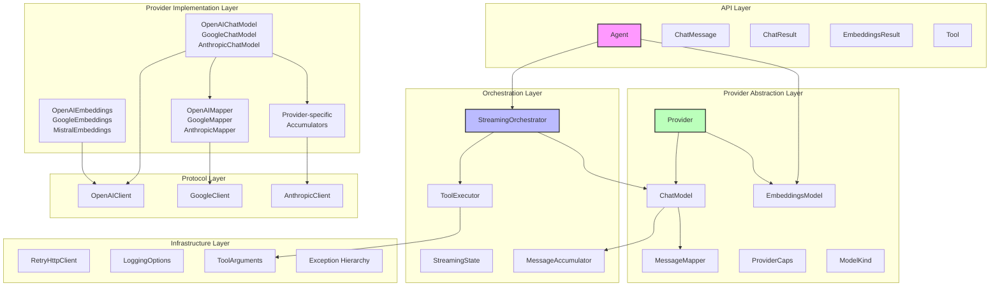
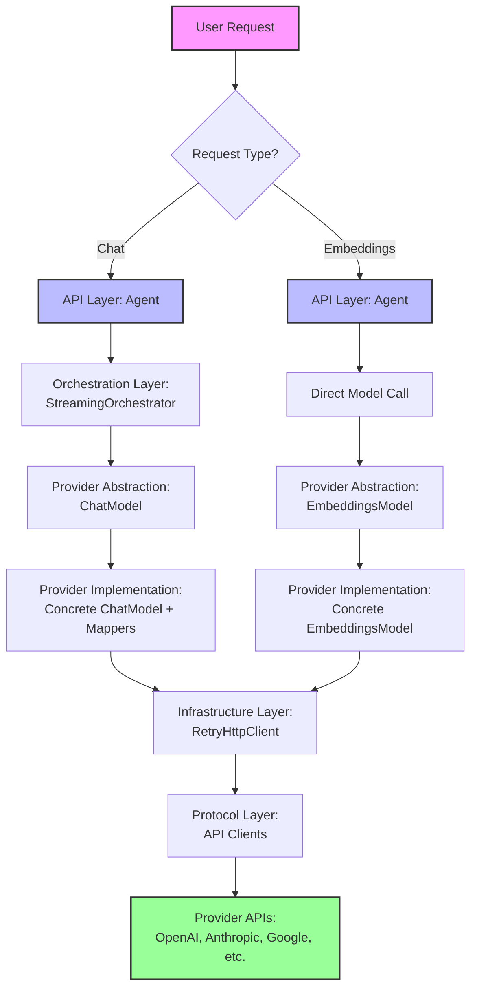

# LangChain Dart Compatibility Layer (Dartantic) - Architecture Overview

This document provides a comprehensive overview of the langchain_compat (dartantic) package architecture and points to detailed specifications for each major system.

## System Purpose

The langchain_compat package provides a unified interface to 15+ LLM providers through a single import, implementing a clean abstraction layer that supports:
- Chat conversations with streaming
- Text embeddings generation
- Tool/function calling 
- Structured JSON output
- Multiple provider types (cloud APIs, local models)
- Comprehensive logging and debugging

## Core Architectural Principles

### 1. **Six-Layer Architecture** (Post-Refactoring)
- **API Layer**: User-facing interface maintaining backward compatibility
  - Agent coordinates chat and embeddings operations
  - Stable public contracts with no breaking changes
  - Input validation and final response formatting
- **Orchestration Layer**: Business logic, streaming coordination, tool execution
  - StreamingOrchestrator manages complete workflows
  - ToolExecutor handles centralized tool execution with error handling
  - StreamingState encapsulates all mutable state during operations
- **Provider Abstraction Layer**: Contracts and interfaces for provider implementations
  - Provider base class unifies chat and embeddings model creation
  - ChatModel and EmbeddingsModel interfaces define provider-agnostic operations
  - MessageAccumulator for provider-agnostic message accumulation during streaming
  - ProviderCaps capability system for type-safe feature detection
- **Provider Implementation Layer**: Concrete provider-specific implementations
  - Per-provider chat and embeddings models, mappers, and accumulation strategies
  - Isolated handling of provider quirks and edge cases
  - Native API support with standardized fallbacks
- **Infrastructure Layer**: Cross-cutting concerns (HTTP, logging, exceptions)
  - RetryHttpClient with automatic rate limit handling
  - Structured exception hierarchy with provider context
  - ToolArguments for type-safe argument handling
- **Protocol Layer**: Low-level communication with provider APIs
  - HTTP client implementations for each provider
  - Request/response serialization and network error handling

### 2. **Provider Abstraction**
- Single unified API regardless of underlying provider
- Static capability declaration for type-safe filtering
- Native API support where available, standardized fallbacks elsewhere

### 3. **Exception Transparency**
- Never catch exceptions to suppress them
- Errors must bubble up with full context
- Only catch to add information, then rethrow
- Structured exception hierarchy with provider context

### 4. **Streaming-First Design**
- All operations built on streaming foundation
- **Critical Principle**: Process entire model stream until it closes before making decisions
  - Prevents premature termination from intermediate empty messages (Anthropic pattern)
  - Distinguishes legitimate empty responses from provider streaming artifacts
- Clean separation of streaming logic (orchestration) from business logic (API layer)
- Consistent streaming behavior across providers through orchestrator abstraction
- Streaming state isolated per request with no shared mutable state

### 5. **Separation of Concerns**
- Each layer has distinct, focused responsibilities with clear boundaries
- **Agent as thin coordination layer**: 56% reduction in size (1091 → 481 lines)
- **Orchestration handles complex workflows**: All business logic extracted from Agent
- **Provider implementations isolated**: Provider quirks contained in implementation layer
- **Infrastructure provides shared utilities**: Cross-cutting concerns centralized
- **Protocol layer handles communication**: Network concerns separated from business logic

### 6. **Resource Management**
- Direct model creation through providers
- Guaranteed cleanup through try/finally patterns in orchestration layer
- Simple disposal with model.dispose() calls
- No exception hiding - disposal errors bubble up for debugging

### 7. **Structured Error Handling**
- Complete exception hierarchy with provider context and operation details
- Errors bubble up through layers with additional context at each level
- Never suppress exceptions - transparency principle maintained
- Type-safe error categorization for better debugging and user experience

## Major System Components

### 🔧 **Provider Capabilities System**
**Purpose**: Dynamic provider discovery and filtering based on supported features
**Location**: [`PROVIDER_CAPABILITIES_DESIGN.md`](./PROVIDER_CAPABILITIES_DESIGN.md)

- Type-safe capability enumeration (`ProviderCaps`)
- Static capability declarations per provider
- Capability-based provider filtering for tests and runtime
- Clear handling of provider limitations

### 🏗️ **Orchestration Layer**
**Purpose**: Business logic coordination and streaming management
**Location**: [`ORCHESTRATION_LAYER_ARCHITECTURE.md`](./ORCHESTRATION_LAYER_ARCHITECTURE.md)

#### Core Orchestrators
- **DefaultStreamingOrchestrator**: Standard chat and tool call workflows
- **TypedOutputStreamingOrchestrator**: Specialized handling for structured JSON output
- **StreamingOrchestrator Interface**: Contract for custom orchestrator implementations

#### Infrastructure Components
- **ToolExecutor**: Centralized tool execution with error handling
- **StreamingState**: Encapsulates all mutable state during streaming operations
- **MessageAccumulator**: Provider-agnostic message accumulation during streaming

#### Orchestrator Selection Logic
```dart
// Agent automatically selects appropriate orchestrator
if (outputSchema != null) {
  return const TypedOutputStreamingOrchestrator();
}
return const DefaultStreamingOrchestrator();
```

### 📝 **Model Naming System** 
**Purpose**: Centralized model selection and default management
**Location**: [`MODEL_NAMING_SPECIFICATION.md`](./MODEL_NAMING_SPECIFICATION.md)

- Single source of truth for default models
- Validation to prevent empty model strings
- Clear distinction between native vs cross-platform providers
- Migration patterns for model updates

### 🌊 **Streaming Tool Call Architecture**
**Purpose**: Comprehensive streaming and tool execution handling
**Location**: [`STREAMING_TOOL_CALL_ARCHITECTURE.md`](./STREAMING_TOOL_CALL_ARCHITECTURE.md)

- Provider-specific streaming protocol handling
- Centralized tool ID generation and coordination
- Message accumulation with metadata preservation
- Tool execution with error handling and streaming UX

### 🔧 **Unified Provider Architecture**
**Purpose**: Complete provider implementation guide and patterns
**Location**: [`UNIFIED_PROVIDER_ARCHITECTURE.md`](./UNIFIED_PROVIDER_ARCHITECTURE.md)

- Provider base class design and interfaces
- Implementation patterns for new providers
- Provider registry and discovery mechanisms
- Canonical implementation examples

### 📝 **Model Naming and String Format**
**Purpose**: Model string parsing and default model management
**Location**: [`MODEL_NAMING_AND_STRING_FORMAT.md`](./MODEL_NAMING_AND_STRING_FORMAT.md)

- Model string formats (simple, legacy, URI)
- ModelStringParser implementation
- Default model tables for all providers
- Resolution flow and edge cases

### 🔑 **Agent Configuration**
**Purpose**: API key and base URL resolution patterns
**Location**: [`AGENT_CONFIG_SPEC.md`](./AGENT_CONFIG_SPEC.md)

- API key resolution hierarchy
- Base URL configuration patterns
- Environment variable handling
- Cross-platform considerations

### 📊 **Typed Output Architecture**
**Purpose**: Structured JSON output handling across providers
**Location**: [`TYPED_OUTPUT_ARCHITECTURE.md`](./TYPED_OUTPUT_ARCHITECTURE.md)

- Native schema support where available
- Tool-based typed output patterns
- Per-message metadata tracking
- JSON validation and parsing

### 💬 **Message Handling Architecture**
**Purpose**: Clean message semantics and provider-specific transformations
**Location**: [`MESSAGE_HANDLING_ARCHITECTURE.md`](./MESSAGE_HANDLING_ARCHITECTURE.md)

- Request/response pair semantics
- Tool result consolidation patterns
- Provider-specific mapper transformations
- Streaming message accumulation

### 📋 **Logging Architecture**
**Purpose**: Comprehensive, user-configurable logging system
**Location**: [`LOGGING_ARCHITECTURE.md`](./LOGGING_ARCHITECTURE.md)

- Hierarchical logger naming (`dartantic.*`)
- Simple user configuration via `Agent.loggingOptions`
- Domain-based organization for debugging
- Integration with Dart's logging package

### 🔌 **OpenAI Compatibility Reference**
**Purpose**: Provider configuration and compatibility documentation
**Location**: [`OpenAI-compat.md`](./OpenAI-compat.md)

- Complete provider directory with base URLs and API keys
- Default model configurations
- OpenAI API compatibility notes
- Provider-specific limitations and features

## Six-Layer Architecture Diagram



## Data Flow Architecture



## Key Design Patterns

### **Static Declaration Pattern**
All configuration is declared statically for fail-fast behavior:
- Model defaults in provider defaultModelNames maps
- Provider capabilities in capability sets
- Logger names in hierarchical structure

### **Capability-Based Selection**
Runtime decisions based on declared capabilities:
```dart
final toolProviders = Provider.allWith({ProviderCaps.multiToolCalls});
final embeddingsProviders = Provider.allWith({ProviderCaps.embeddings});
```

### **Provider-Agnostic Interface**
Same API regardless of underlying provider:
```dart
final agent = Agent('openai:gpt-4', tools: tools);
final agent = Agent('anthropic:claude-3-5-sonnet', tools: tools);
// Identical API for chat
await agent.send('Hello');
await agent.sendStream('Tell me a story');

// Unified embeddings support
await agent.embedQuery('search text');
await agent.embedDocuments(['doc1', 'doc2']);
```

### **Orchestration-Based Design**
Agent acts as thin coordination layer delegating to specialized orchestrators:
```dart
final agent = Agent('openai:gpt-4', tools: tools);

// Agent flow with orchestrator delegation:
// 1. Select orchestrator based on request characteristics
// 2. Create StreamingState with conversation history and tools
// 3. Initialize orchestrator with state
// 4. Process streaming iterations until complete
// 5. Finalize orchestrator and clean up resources

// Orchestrator types automatically selected:
await agent.sendStream('Hello');              // → DefaultStreamingOrchestrator
await agent.sendFor<Person>(..., schema);     // → TypedOutputStreamingOrchestrator
```

### **Layered Error Handling**
- **API Layer (Agent)**: User-friendly error messages and final formatting
- **Orchestration Layer**: Business logic errors and retry coordination
- **Provider Abstraction**: Contract-level error definitions
- **Provider Implementation**: Provider-specific error handling and mapping
- **Infrastructure Layer**: Cross-cutting error utilities and structured exceptions
- **Protocol Layer**: Network-level error recovery
- No defensive exception hiding - errors bubble up with full context

### **Message Metadata Pattern**
Per-message visibility into processing decisions:
- Suppressed text content when using typed output
- Dropped tool calls alongside return_result
- Extra return_result calls beyond the first
- Preserved during message accumulation in Agent layer

## Provider Support

For a complete matrix of provider capabilities and supported features, see the [Provider Capability Matrix](./UNIFIED_PROVIDER_ARCHITECTURE.md#provider-capability-matrix) in the Unified Provider Architecture specification.

## Testing Strategy

### **Capability-Based Test Filtering**
Tests automatically filter providers based on required capabilities:
```dart
final toolProviders = Provider.allWith({ProviderCaps.multiToolCalls});
final embeddingsProviders = Provider.allWith({ProviderCaps.embeddings});
// Only test providers that support specific features
```

### **80% vs Edge Case Separation**
- **80% Cases**: Core functionality across all supporting providers
- **Edge Cases**: Special scenarios on limited providers (typically OpenAI + Anthropic)

### **Comprehensive Integration Testing**
The system includes comprehensive tests that validate:
- Multi-turn conversations with tool calls across all providers
- Message history validation (user/model alternation)
- Multiple tool calls in single turns
- Embeddings generation and similarity calculations
- See: `system_integration_test.dart` - "multi-turn conversation with multiple tool calls and message validation"

### **Ground Truth Validation**
When debugging provider issues:
1. Use curl to test raw API behavior
2. Compare with our implementation
3. Fix root cause, don't hide exceptions

## Development Guidelines

### **Adding New Providers**
1. Extend the unified Provider base class
2. Declare capabilities in provider definition
3. Set defaultModelNames map for ModelKind.chat and ModelKind.embeddings
4. Implement createChatModel() and createEmbeddingsModel() methods
5. Add static instance to Provider registry
6. Update tests to include new provider
7. Consider if custom orchestrator needed for provider quirks

### **Adding New Features**
1. Define capabilities if provider-specific
2. Implement in six-layer pattern following separation of concerns
3. Consider which layer is appropriate for the feature:
   - API Layer: Public interface changes
   - Orchestration Layer: Business logic and workflow changes
   - Provider Abstraction: Cross-provider contracts
   - Provider Implementation: Provider-specific behavior
   - Infrastructure: Cross-cutting concerns
   - Protocol: Network communication changes
4. Update logging hierarchy as needed
5. Create specification document
6. Add capability-based tests

### **Debugging Issues**
1. Enable hierarchical logging via `Agent.loggingOptions`
2. Use curl for ground truth API testing
3. Check provider capabilities and limitations
4. Reference relevant specification documents
5. Follow fail-fast principle - fix root cause
6. Leverage structured exception hierarchy for context
7. Use orchestrator layer for complex debugging scenarios
8. Verify both chat and embeddings support for provider issues

## Related Documentation

- **Unified Provider Architecture**: See [`UNIFIED_PROVIDER_ARCHITECTURE.md`](./UNIFIED_PROVIDER_ARCHITECTURE.md) for the new provider system
- **Model Naming**: See [`MODEL_NAMING_AND_STRING_FORMAT.md`](./MODEL_NAMING_AND_STRING_FORMAT.md) for model string formats
- **Agent Configuration**: See [`AGENT_CONFIG_SPEC.md`](./AGENT_CONFIG_SPEC.md) for API key and URL resolution
- **Migration Guide**: See [`DARTANTIC_1.0_MIGRATION_SPEC.md`](./DARTANTIC_1.0_MIGRATION_SPEC.md) for upgrading from langchain_compat
- **Provider Setup**: See [`OpenAI-compat.md`](./OpenAI-compat.md) for API keys and configuration
- **Testing Patterns**: See [`PROVIDER_CAPABILITIES_DESIGN.md`](./PROVIDER_CAPABILITIES_DESIGN.md) for test filtering

## Future Architecture Considerations

### **Planned Enhancements**
- **Vision/Audio Capabilities**: Capability system ready for multimedia support
- **Batch Processing**: Orchestration layer provides foundation for batch workflows
- **Context Caching**: Integration points available in orchestration layer
- **Performance Monitoring**: Built-in metrics hooks in orchestrators and executors
- **Custom Orchestrators**: Specialized workflows (multi-step reasoning, reflection patterns)
- **Parallel Tool Execution**: ParallelToolExecutor for concurrent tool calls
- **Provider-Specific Orchestrators**: Optimizations for provider-specific workflows

### **Potential Consolidations**
- **Unified Provider Registry**: Combining capabilities, defaults, and configuration
- **Centralized Error Handling**: Structured exception hierarchy across all layers
- **Performance Guidelines**: Monitoring and optimization best practices
- **Integration Examples**: Complete six-layer workflow demonstrations
- **Orchestrator Ecosystem**: Pluggable orchestrator marketplace and patterns

### **Advanced Customization Patterns**

#### Custom Orchestrator Development
```dart
class MultiStepReasoningOrchestrator implements StreamingOrchestrator {
  @override
  String get providerHint => 'multi-step-reasoning';
  
  @override
  Stream<StreamingIterationResult> processIteration(...) async* {
    // Implement custom reasoning workflow
    // 1. Initial analysis phase
    // 2. Hypothesis generation
    // 3. Evidence gathering via tools
    // 4. Conclusion synthesis
  }
}
```

#### Future Tool Execution Enhancements
```dart
// Potential future enhancement: Parallel tool execution
class ParallelToolExecutor extends ToolExecutor {
  @override
  Future<List<ToolExecutionResult>> executeBatch(...) async {
    // Execute independent tools in parallel
    final futures = toolCalls.map((call) => executeSingle(call, toolMap));
    return await Future.wait(futures);
  }
}
```

This six-layer architecture provides a robust, maintainable foundation for supporting diverse LLM providers while maintaining a clean, consistent API for users. The unified provider architecture enables both chat and embeddings support through a single interface, while the orchestration layer enables complex workflow management without compromising the simplicity of the public API. The clear separation of concerns across all layers facilitates both debugging and future enhancements.
