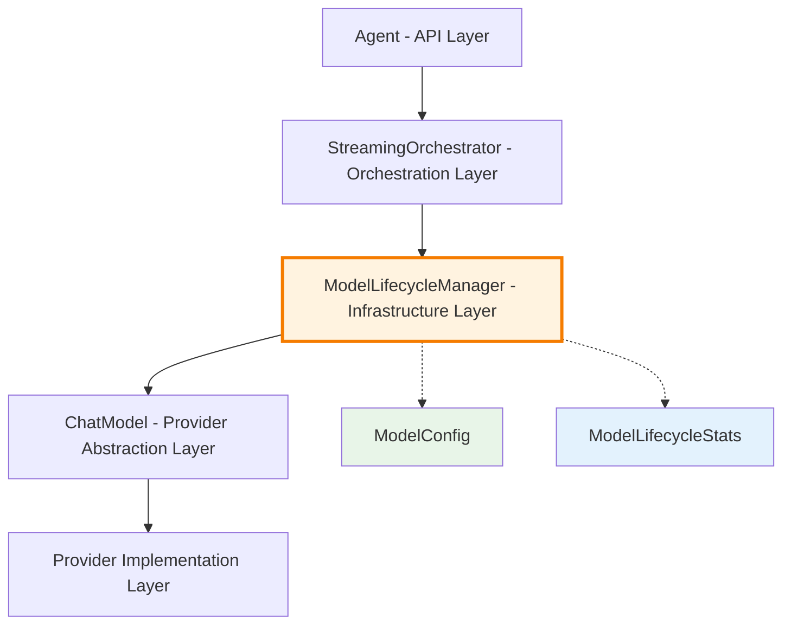

# Model Lifecycle Architecture

This document specifies the model lifecycle management system in the LangChain Dart compatibility layer, focusing on proper resource management, creation patterns, and disposal strategies for LLM models.

## Table of Contents
1. [Overview](#overview)
2. [Design Principles](#design-principles)
3. [ModelLifecycleManager Interface](#modellifecyclemanager-interface)
4. [Model Configuration](#model-configuration)
5. [Creation Lifecycle](#creation-lifecycle)
6. [Resource Management](#resource-management)
7. [Disposal Patterns](#disposal-patterns)
8. [Error Handling](#error-handling)
9. [Provider-Specific Considerations](#provider-specific-considerations)
10. [Performance Optimizations](#performance-optimizations)
11. [Testing Strategies](#testing-strategies)
12. [Monitoring and Debugging](#monitoring-and-debugging)
13. [Future Enhancements](#future-enhancements)

## Overview

The model lifecycle architecture addresses critical resource management issues that can occur in long-running applications using multiple LLM providers. Without proper lifecycle management, applications can suffer from:

- **Resource Leaks**: Models not properly disposed, leading to memory leaks
- **Connection Issues**: HTTP connections not closed, exhausting connection pools
- **State Corruption**: Shared model instances causing state conflicts
- **Performance Degradation**: Inefficient model creation and reuse patterns

The new architecture provides:

- **Guaranteed Cleanup**: Try/finally patterns ensure model disposal
- **Centralized Management**: Single point of control for model lifecycle
- **Provider Abstraction**: Consistent lifecycle regardless of provider
- **Resource Tracking**: Monitoring and debugging of model usage patterns

### Architectural Position



### Model Lifecycle Flow

```mermaid
sequenceDiagram
    participant Agent
    participant Manager as ModelLifecycleManager
    participant Provider as ChatProvider
    participant Model as ChatModel
    
    Agent->>+Manager: createModel(config)
    Manager->>Manager: validate config
    Manager->>+Provider: createModel(params)
    Provider-->>-Manager: model instance
    Manager->>Manager: update metrics
    Manager-->>-Agent: model
    
    Agent->>Agent: use model for streaming
    
    Agent->>+Manager: disposeModel(model)
    Manager->>+Model: dispose()
    Model-->>-Manager: cleanup complete
    Manager->>Manager: update metrics
    Manager-->>-Agent: disposal complete
    
    note over Manager,Model
        Disposal never throws -
        errors are logged only
    end note
```

## Design Principles

### 1. Guaranteed Cleanup
Every model creation must have a corresponding disposal, enforced through try/finally patterns.

### 2. Centralized Control
All model lifecycle operations go through the `ModelLifecycleManager` interface.

### 3. Provider Agnostic
The same lifecycle patterns work across all providers without provider-specific code.

### 4. Resource Transparency
Clear visibility into model creation, usage, and disposal through logging and metrics.

### 5. Fail-Safe Disposal
Model disposal never throws exceptions that could break user workflows.

### 6. Efficient Patterns
Support for model reuse and pooling patterns where appropriate.

## ModelLifecycleManager Interface

### Core Interface

```dart
/// Manages the complete lifecycle of chat models
abstract interface class ModelLifecycleManager {
  /// Create a new model with the specified configuration
  /// 
  /// This method handles:
  /// - Provider-specific model instantiation
  /// - Configuration validation
  /// - Resource allocation
  /// - Lifecycle tracking
  Future<ChatModel<ChatModelOptions>> createModel(ModelConfig config);
  
  /// Dispose of a model and clean up its resources
  /// 
  /// This method handles:
  /// - Resource cleanup (HTTP connections, etc.)
  /// - State clearing
  /// - Lifecycle tracking
  /// - Error suppression (disposal never throws)
  Future<void> disposeModel(ChatModel<ChatModelOptions> model);
  
  /// Get statistics about managed models
  /// Useful for monitoring and debugging
  ModelLifecycleStats getStats();
}
```

### ModelConfig Class

```dart
/// Configuration for model creation
class ModelConfig {
  /// The provider to use for model creation
  final ChatProvider provider;
  
  /// The specific model name (e.g., 'gpt-4o', 'claude-3-5-sonnet')
  final String modelName;
  
  /// Tools available to the model
  final List<Tool>? tools;
  
  /// Temperature setting for generation
  final double? temperature;
  
  /// System prompt for the model
  final String? systemPrompt;
  
  /// Additional provider-specific options
  final Map<String, dynamic>? additionalOptions;
  
  const ModelConfig({
    required this.provider,
    required this.modelName,
    this.tools,
    this.temperature,
    this.systemPrompt,
    this.additionalOptions,
  });
  
  /// Create a copy with modified fields
  ModelConfig copyWith({
    ChatProvider? provider,
    String? modelName,
    List<Tool>? tools,
    double? temperature,
    String? systemPrompt,
    Map<String, dynamic>? additionalOptions,
  }) {
    return ModelConfig(
      provider: provider ?? this.provider,
      modelName: modelName ?? this.modelName,
      tools: tools ?? this.tools,
      temperature: temperature ?? this.temperature,
      systemPrompt: systemPrompt ?? this.systemPrompt,
      additionalOptions: additionalOptions ?? this.additionalOptions,
    );
  }
  
  @override
  String toString() {
    return 'ModelConfig(provider: ${provider.name}, model: $modelName, '
           'tools: ${tools?.length ?? 0}, temp: $temperature)';
  }
}
```

### ModelLifecycleStats

```dart
/// Statistics about model lifecycle operations
class ModelLifecycleStats {
  /// Total number of models created
  final int modelsCreated;
  
  /// Total number of models disposed
  final int modelsDisposed;
  
  /// Currently active models (created - disposed)
  final int activeModels;
  
  /// Average model creation time in milliseconds
  final double averageCreationTimeMs;
  
  /// Models created by provider
  final Map<String, int> modelsByProvider;
  
  /// Recent disposal errors (for debugging)
  final List<String> recentDisposalErrors;
  
  const ModelLifecycleStats({
    required this.modelsCreated,
    required this.modelsDisposed,
    required this.activeModels,
    required this.averageCreationTimeMs,
    required this.modelsByProvider,
    required this.recentDisposalErrors,
  });
  
  /// Check if there are potential resource leaks
  bool get hasPotentialLeaks => activeModels > 10;
  
  /// Get summary for logging/monitoring
  Map<String, dynamic> toJson() {
    return {
      'modelsCreated': modelsCreated,
      'modelsDisposed': modelsDisposed,
      'activeModels': activeModels,
      'averageCreationTimeMs': averageCreationTimeMs,
      'modelsByProvider': modelsByProvider,
      'recentDisposalErrors': recentDisposalErrors,
      'hasPotentialLeaks': hasPotentialLeaks,
    };
  }
}
```

## Model Configuration

### Configuration Validation

```dart
/// Validate model configuration before creation
class ModelConfigValidator {
  static void validate(ModelConfig config) {
    // Provider validation
    if (config.provider == null) {
      throw ArgumentError('Provider cannot be null');
    }
    
    // Model name validation
    if (config.modelName.isEmpty) {
      throw ArgumentError('Model name cannot be empty');
    }
    
    // Temperature validation
    if (config.temperature != null) {
      if (config.temperature! < 0.0 || config.temperature! > 2.0) {
        throw ArgumentError('Temperature must be between 0.0 and 2.0');
      }
    }
    
    // Tools validation
    if (config.tools != null) {
      final toolNames = config.tools!.map((t) => t.name).toSet();
      if (toolNames.length != config.tools!.length) {
        throw ArgumentError('Duplicate tool names not allowed');
      }
    }
    
    // Provider-specific validation
    _validateProviderSpecific(config);
  }
  
  static void _validateProviderSpecific(ModelConfig config) {
    switch (config.provider.name) {
      case 'mistral':
        if (config.tools?.isNotEmpty ?? false) {
          throw ArgumentError('Mistral provider does not support tools');
        }
        break;
      case 'cohere':
        if (config.tools?.isNotEmpty ?? false && 
            config.additionalOptions?['outputSchema'] != null) {
          throw ArgumentError('Cohere cannot use tools and typed output simultaneously');
        }
        break;
      // Add other provider-specific validations
    }
  }
}
```

### Configuration Builder Pattern

```dart
/// Builder pattern for complex model configurations
class ModelConfigBuilder {
  ChatProvider? _provider;
  String? _modelName;
  List<Tool>? _tools;
  double? _temperature;
  String? _systemPrompt;
  Map<String, dynamic>? _additionalOptions;
  
  /// Set the provider
  ModelConfigBuilder withProvider(ChatProvider provider) {
    _provider = provider;
    return this;
  }
  
  /// Set the model name
  ModelConfigBuilder withModel(String modelName) {
    _modelName = modelName;
    return this;
  }
  
  /// Add tools
  ModelConfigBuilder withTools(List<Tool> tools) {
    _tools = tools;
    return this;
  }
  
  /// Set temperature
  ModelConfigBuilder withTemperature(double temperature) {
    _temperature = temperature;
    return this;
  }
  
  /// Set system prompt
  ModelConfigBuilder withSystemPrompt(String systemPrompt) {
    _systemPrompt = systemPrompt;
    return this;
  }
  
  /// Add additional options
  ModelConfigBuilder withOptions(Map<String, dynamic> options) {
    _additionalOptions = {...?_additionalOptions, ...options};
    return this;
  }
  
  /// Build the configuration
  ModelConfig build() {
    if (_provider == null) throw StateError('Provider must be set');
    if (_modelName == null) throw StateError('Model name must be set');
    
    final config = ModelConfig(
      provider: _provider!,
      modelName: _modelName!,
      tools: _tools,
      temperature: _temperature,
      systemPrompt: _systemPrompt,
      additionalOptions: _additionalOptions,
    );
    
    ModelConfigValidator.validate(config);
    return config;
  }
}
```

## Creation Lifecycle

### DefaultModelLifecycleManager Implementation

```dart
/// Default implementation of model lifecycle management
class DefaultModelLifecycleManager implements ModelLifecycleManager {
  DefaultModelLifecycleManager({
    this.enableMetrics = true,
    this.maxDisposalErrors = 10,
  });
  
  final bool enableMetrics;
  final int maxDisposalErrors;
  
  static final _logger = Logger('dartantic.lifecycle.model');
  
  // Metrics tracking
  int _modelsCreated = 0;
  int _modelsDisposed = 0;
  final List<Duration> _creationTimes = [];
  final Map<String, int> _modelsByProvider = {};
  final List<String> _recentDisposalErrors = [];
  
  @override
  Future<ChatModel<ChatModelOptions>> createModel(ModelConfig config) async {
    final stopwatch = Stopwatch()..start();
    
    _logger.fine(
      'Creating model with config: provider=${config.provider.name}, '
      'model=${config.modelName}, tools=${config.tools?.length ?? 0}',
    );
    
    try {
      // Validate configuration
      ModelConfigValidator.validate(config);
      
      // Create model through provider
      final model = config.provider.createModel(
        name: config.modelName,
        tools: config.tools,
        temperature: config.temperature,
        systemPrompt: config.systemPrompt,
      );
      
      stopwatch.stop();
      
      // Update metrics
      if (enableMetrics) {
        _updateCreationMetrics(config, stopwatch.elapsed);
      }
      
      _logger.info(
        'Model created successfully: ${model.runtimeType} '
        '(${stopwatch.elapsedMilliseconds}ms)',
      );
      
      return model;
      
    } catch (error, stackTrace) {
      stopwatch.stop();
      _logger.severe(
        'Model creation failed for ${config.provider.name}:${config.modelName}: $error',
        error,
        stackTrace,
      );
      rethrow;
    }
  }
  
  @override
  Future<void> disposeModel(ChatModel<ChatModelOptions> model) async {
    _logger.fine('Disposing model: ${model.runtimeType}');
    
    try {
      // Call model's dispose method
      model.dispose();
      
      // Update metrics
      if (enableMetrics) {
        _modelsDisposed++;
      }
      
      _logger.fine('Model disposed successfully');
      
    } catch (error, stackTrace) {
      // CRITICAL: Never throw from disposal - just log
      final errorMessage = 'Model disposal failed: $error';
      _logger.warning(errorMessage, error, stackTrace);
      
      // Track disposal errors for debugging
      if (enableMetrics) {
        _recentDisposalErrors.add(errorMessage);
        if (_recentDisposalErrors.length > maxDisposalErrors) {
          _recentDisposalErrors.removeAt(0);
        }
      }
      
      // Don't rethrow - disposal failure shouldn't break user flow
    }
  }
  
  @override
  ModelLifecycleStats getStats() {
    return ModelLifecycleStats(
      modelsCreated: _modelsCreated,
      modelsDisposed: _modelsDisposed,
      activeModels: _modelsCreated - _modelsDisposed,
      averageCreationTimeMs: _creationTimes.isNotEmpty
          ? _creationTimes.map((d) => d.inMilliseconds).reduce((a, b) => a + b) / _creationTimes.length
          : 0.0,
      modelsByProvider: Map.unmodifiable(_modelsByProvider),
      recentDisposalErrors: List.unmodifiable(_recentDisposalErrors),
    );
  }
  
  void _updateCreationMetrics(ModelConfig config, Duration elapsed) {
    _modelsCreated++;
    _creationTimes.add(elapsed);
    
    final providerName = config.provider.name;
    _modelsByProvider[providerName] = (_modelsByProvider[providerName] ?? 0) + 1;
    
    // Keep metrics bounded
    if (_creationTimes.length > 1000) {
      _creationTimes.removeRange(0, 100);
    }
  }
}
```

### Usage in Agent

```dart
/// Agent integration with lifecycle manager
class Agent {
  late final ModelLifecycleManager _lifecycleManager;
  
  Agent(String model, {List<Tool>? tools, ...}) {
    // Initialize with default lifecycle manager
    _lifecycleManager = const DefaultModelLifecycleManager();
    // ... other initialization
  }
  
  /// Custom constructor with lifecycle manager
  Agent.withLifecycleManager(
    String model,
    ModelLifecycleManager lifecycleManager, {
    List<Tool>? tools,
    ...
  }) {
    _lifecycleManager = lifecycleManager;
    // ... other initialization
  }
  
  Stream<ChatResult<String>> runStream(
    String prompt, {
    List<ChatMessage> history = const [],
    List<Part> attachments = const [],
    JsonSchema? outputSchema,
  }) async* {
    // Create model using lifecycle manager
    final model = await _lifecycleManager.createModel(
      ModelConfig(
        provider: _provider,
        modelName: _modelName,
        tools: tools,
        temperature: _temperature,
        systemPrompt: _systemPrompt,
      ),
    );
    
    try {
      // Streaming workflow with orchestrator
      final orchestrator = _selectOrchestrator(outputSchema: outputSchema);
      final state = StreamingState(
        conversationHistory: conversationHistory,
        toolMap: {for (final tool in model.tools ?? <Tool>[]) tool.name: tool},
      );
      
      orchestrator.initialize(state);
      
      try {
        while (!state.done) {
          await for (final result in orchestrator.processIteration(model, state, outputSchema: outputSchema)) {
            yield ChatResult<String>(
              id: result.id,
              output: result.output,
              messages: result.messages,
              finishReason: result.finishReason,
              metadata: result.metadata,
              usage: result.usage,
            );
            
            if (!result.shouldContinue) {
              state.markDone();
              break;
            }
          }
        }
      } finally {
        orchestrator.finalize(state);
      }
      
    } finally {
      // GUARANTEED cleanup - this always executes
      await _lifecycleManager.disposeModel(model);
    }
  }
}
```

## Resource Management

### Connection Pool Management

```dart
/// Enhanced lifecycle manager with connection pooling
class PoolingModelLifecycleManager implements ModelLifecycleManager {
  PoolingModelLifecycleManager({
    this.maxPoolSize = 5,
    this.maxIdleTime = Duration(minutes: 5),
  });
  
  final int maxPoolSize;
  final Duration maxIdleTime;
  
  final Map<String, List<_PooledModel>> _modelPools = {};
  final Timer? _cleanupTimer;
  
  @override
  Future<ChatModel<ChatModelOptions>> createModel(ModelConfig config) async {
    final poolKey = _getPoolKey(config);
    
    // Try to reuse from pool
    final pooledModel = _getFromPool(poolKey);
    if (pooledModel != null) {
      _logger.fine('Reusing model from pool: $poolKey');
      return pooledModel.model;
    }
    
    // Create new model
    final model = config.provider.createModel(
      name: config.modelName,
      tools: config.tools,
      temperature: config.temperature,
      systemPrompt: config.systemPrompt,
    );
    
    _logger.info('Created new model for pool: $poolKey');
    return model;
  }
  
  @override
  Future<void> disposeModel(ChatModel<ChatModelOptions> model) async {
    // Try to return to pool instead of disposing
    final poolKey = _getPoolKeyFromModel(model);
    if (poolKey != null && _canReturnToPool(poolKey)) {
      _returnToPool(poolKey, model);
      return;
    }
    
    // Pool full or not poolable - dispose normally
    try {
      model.dispose();
    } catch (error) {
      _logger.warning('Model disposal failed: $error');
    }
  }
  
  String _getPoolKey(ModelConfig config) {
    return '${config.provider.name}:${config.modelName}:${config.temperature ?? 0.7}';
  }
  
  _PooledModel? _getFromPool(String poolKey) {
    final pool = _modelPools[poolKey];
    if (pool == null || pool.isEmpty) return null;
    
    return pool.removeLast();
  }
  
  void _returnToPool(String poolKey, ChatModel<ChatModelOptions> model) {
    final pool = _modelPools.putIfAbsent(poolKey, () => []);
    
    if (pool.length < maxPoolSize) {
      pool.add(_PooledModel(model, DateTime.now()));
      _logger.fine('Returned model to pool: $poolKey (${pool.length}/$maxPoolSize)');
    } else {
      // Pool full - dispose
      try {
        model.dispose();
      } catch (error) {
        _logger.warning('Model disposal failed: $error');
      }
    }
  }
  
  /// Cleanup expired models from pools
  void _cleanupExpiredModels() {
    final now = DateTime.now();
    
    for (final entry in _modelPools.entries) {
      final poolKey = entry.key;
      final pool = entry.value;
      
      pool.removeWhere((pooledModel) {
        final isExpired = now.difference(pooledModel.lastUsed) > maxIdleTime;
        if (isExpired) {
          try {
            pooledModel.model.dispose();
            _logger.fine('Disposed expired model from pool: $poolKey');
          } catch (error) {
            _logger.warning('Failed to dispose expired model: $error');
          }
        }
        return isExpired;
      });
    }
  }
}

class _PooledModel {
  final ChatModel<ChatModelOptions> model;
  final DateTime lastUsed;
  
  _PooledModel(this.model, this.lastUsed);
}
```

### Memory Management

```dart
/// Memory-aware lifecycle manager
class MemoryAwareLifecycleManager implements ModelLifecycleManager {
  MemoryAwareLifecycleManager({
    this.maxMemoryUsageMB = 512,
    this.memoryCheckInterval = Duration(minutes: 1),
  });
  
  final int maxMemoryUsageMB;
  final Duration memoryCheckInterval;
  
  final Set<ChatModel<ChatModelOptions>> _activeModels = {};
  Timer? _memoryMonitor;
  
  @override
  Future<ChatModel<ChatModelOptions>> createModel(ModelConfig config) async {
    await _checkMemoryUsage();
    
    final model = config.provider.createModel(
      name: config.modelName,
      tools: config.tools,
      temperature: config.temperature,
      systemPrompt: config.systemPrompt,
    );
    
    _activeModels.add(model);
    _startMemoryMonitoring();
    
    return model;
  }
  
  @override
  Future<void> disposeModel(ChatModel<ChatModelOptions> model) async {
    _activeModels.remove(model);
    
    try {
      model.dispose();
    } catch (error) {
      _logger.warning('Model disposal failed: $error');
    }
    
    if (_activeModels.isEmpty) {
      _stopMemoryMonitoring();
    }
  }
  
  Future<void> _checkMemoryUsage() async {
    // Platform-specific memory checking would go here
    // For now, just check active model count as proxy
    if (_activeModels.length > 10) {
      _logger.warning('High number of active models: ${_activeModels.length}');
    }
  }
  
  void _startMemoryMonitoring() {
    _memoryMonitor ??= Timer.periodic(memoryCheckInterval, (_) {
      _checkMemoryUsage();
    });
  }
  
  void _stopMemoryMonitoring() {
    _memoryMonitor?.cancel();
    _memoryMonitor = null;
  }
}
```

## Disposal Patterns

### Safe Disposal Implementation

```dart
/// Safe model disposal with comprehensive error handling
extension SafeDisposal on ModelLifecycleManager {
  /// Dispose multiple models safely
  Future<void> disposeAll(List<ChatModel<ChatModelOptions>> models) async {
    final disposalFutures = models.map((model) async {
      try {
        await disposeModel(model);
      } catch (error) {
        // Log individual disposal errors but don't stop the process
        _logger.warning('Failed to dispose model ${model.runtimeType}: $error');
      }
    });
    
    // Wait for all disposals to complete
    await Future.wait(disposalFutures);
  }
  
  /// Dispose with timeout
  Future<void> disposeWithTimeout(
    ChatModel<ChatModelOptions> model, {
    Duration timeout = const Duration(seconds: 30),
  }) async {
    try {
      await Future.any([
        disposeModel(model),
        Future.delayed(timeout, () => throw TimeoutException('Disposal timeout', timeout)),
      ]);
    } on TimeoutException {
      _logger.warning('Model disposal timed out after ${timeout.inSeconds}s');
    }
  }
}
```

### Disposal Patterns in Practice

```dart
/// Common disposal patterns
class DisposalPatterns {
  /// Pattern 1: Simple try/finally
  static Future<String> simplePattern(Agent agent, String prompt) async {
    final model = await agent._lifecycleManager.createModel(config);
    
    try {
      return await model.invoke(prompt);
    } finally {
      await agent._lifecycleManager.disposeModel(model);
    }
  }
  
  /// Pattern 2: Resource-per-request
  static Stream<String> streamingPattern(Agent agent, String prompt) async* {
    final model = await agent._lifecycleManager.createModel(config);
    
    try {
      await for (final chunk in model.sendStream([ChatMessage.userText(prompt)])) {
        yield chunk.output.parts.whereType<TextPart>().map((p) => p.text).join();
      }
    } finally {
      await agent._lifecycleManager.disposeModel(model);
    }
  }
  
  /// Pattern 3: Batch operations
  static Future<List<String>> batchPattern(
    Agent agent, 
    List<String> prompts,
  ) async {
    final model = await agent._lifecycleManager.createModel(config);
    
    try {
      final results = <String>[];
      for (final prompt in prompts) {
        final result = await model.invoke(prompt);
        results.add(result);
      }
      return results;
    } finally {
      await agent._lifecycleManager.disposeModel(model);
    }
  }
  
  /// Pattern 4: Error recovery
  static Future<String> errorRecoveryPattern(Agent agent, String prompt) async {
    ChatModel<ChatModelOptions>? model;
    
    try {
      model = await agent._lifecycleManager.createModel(config);
      return await model.invoke(prompt);
    } catch (error) {
      // Handle error, possibly retry with different model
      rethrow;
    } finally {
      if (model != null) {
        await agent._lifecycleManager.disposeModel(model);
      }
    }
  }
}
```

## Error Handling

### Lifecycle Exception Hierarchy

```dart
/// Base exception for lifecycle operations
abstract class LifecycleException implements Exception {
  final String message;
  final Exception? cause;
  
  const LifecycleException(this.message, {this.cause});
  
  @override
  String toString() => 'LifecycleException: $message';
}

/// Exception during model creation
class ModelCreationException extends LifecycleException {
  final ModelConfig config;
  
  const ModelCreationException(
    super.message, {
    super.cause,
    required this.config,
  });
  
  @override
  String toString() => 'ModelCreationException(${config.provider.name}:${config.modelName}): $message';
}

/// Exception during model disposal (rare, since disposal should not throw)
class ModelDisposalException extends LifecycleException {
  final String modelType;
  
  const ModelDisposalException(
    super.message, {
    super.cause,
    required this.modelType,
  });
  
  @override
  String toString() => 'ModelDisposalException($modelType): $message';
}

/// Exception due to configuration issues
class ModelConfigurationException extends LifecycleException {
  final ModelConfig config;
  final String validationError;
  
  const ModelConfigurationException(
    super.message, {
    super.cause,
    required this.config,
    required this.validationError,
  });
  
  @override
  String toString() => 'ModelConfigurationException: $validationError';
}
```

### Error Recovery Strategies

```dart
/// Error recovery strategies for model lifecycle
class LifecycleErrorRecovery {
  /// Retry model creation with exponential backoff
  static Future<ChatModel<ChatModelOptions>> retryCreation(
    ModelLifecycleManager manager,
    ModelConfig config, {
    int maxRetries = 3,
    Duration baseDelay = const Duration(seconds: 1),
  }) async {
    var attempt = 0;
    Exception? lastError;
    
    while (attempt < maxRetries) {
      try {
        return await manager.createModel(config);
      } on ModelCreationException catch (error) {
        lastError = error;
        attempt++;
        
        if (attempt < maxRetries) {
          final delay = baseDelay * (1 << (attempt - 1)); // Exponential backoff
          _logger.info('Model creation failed, retrying in ${delay.inSeconds}s (attempt $attempt/$maxRetries)');
          await Future.delayed(delay);
        }
      }
    }
    
    throw ModelCreationException(
      'Failed to create model after $maxRetries attempts',
      cause: lastError,
      config: config,
    );
  }
  
  /// Fallback to different model if primary fails
  static Future<ChatModel<ChatModelOptions>> withFallback(
    ModelLifecycleManager manager,
    ModelConfig primaryConfig,
    ModelConfig fallbackConfig,
  ) async {
    try {
      return await manager.createModel(primaryConfig);
    } on ModelCreationException catch (error) {
      _logger.warning(
        'Primary model creation failed, trying fallback: ${error.message}',
      );
      
      try {
        return await manager.createModel(fallbackConfig);
      } on ModelCreationException catch (fallbackError) {
        throw ModelCreationException(
          'Both primary and fallback model creation failed',
          cause: fallbackError,
          config: fallbackConfig,
        );
      }
    }
  }
}
```

## Provider-Specific Considerations

### Provider Lifecycle Patterns

```dart
/// Provider-specific lifecycle optimizations
class ProviderSpecificLifecycle {
  /// OpenAI-specific optimizations
  static Future<ChatModel<ChatModelOptions>> createOpenAIModel(
    ModelConfig config,
  ) async {
    // OpenAI models are stateless - no special lifecycle needed
    return config.provider.createModel(
      name: config.modelName,
      tools: config.tools,
      temperature: config.temperature,
      systemPrompt: config.systemPrompt,
    );
  }
  
  /// Anthropic-specific optimizations
  static Future<ChatModel<ChatModelOptions>> createAnthropicModel(
    ModelConfig config,
  ) async {
    // Anthropic models may benefit from connection pooling
    // Due to their event-based streaming nature
    return config.provider.createModel(
      name: config.modelName,
      tools: config.tools,
      temperature: config.temperature,
      systemPrompt: config.systemPrompt,
    );
  }
  
  /// Ollama-specific optimizations
  static Future<ChatModel<ChatModelOptions>> createOllamaModel(
    ModelConfig config,
  ) async {
    // Ollama models may need warm-up time for local loading
    final model = config.provider.createModel(
      name: config.modelName,
      tools: config.tools,
      temperature: config.temperature,
      systemPrompt: config.systemPrompt,
    );
    
    // Optional: Pre-warm the model with a simple request
    // await _warmUpModel(model);
    
    return model;
  }
}
```

### Provider Disposal Patterns

```dart
/// Provider-specific disposal considerations
extension ProviderDisposal on DefaultModelLifecycleManager {
  Future<void> disposeWithProviderOptimizations(
    ChatModel<ChatModelOptions> model,
  ) async {
    final modelType = model.runtimeType.toString();
    
    try {
      // Provider-specific disposal logic
      switch (modelType) {
        case 'OpenAIChatModel':
          await _disposeOpenAIModel(model);
          break;
        case 'AnthropicChatModel':
          await _disposeAnthropicModel(model);
          break;
        case 'OllamaChatModel':
          await _disposeOllamaModel(model);
          break;
        default:
          // Generic disposal
          model.dispose();
      }
    } catch (error) {
      _logger.warning('Provider-specific disposal failed: $error');
      // Fallback to generic disposal
      try {
        model.dispose();
      } catch (fallbackError) {
        _logger.severe('Generic disposal also failed: $fallbackError');
      }
    }
  }
  
  Future<void> _disposeOpenAIModel(ChatModel<ChatModelOptions> model) async {
    // OpenAI models are stateless - standard disposal is fine
    model.dispose();
  }
  
  Future<void> _disposeAnthropicModel(ChatModel<ChatModelOptions> model) async {
    // Anthropic models may have streaming connections to close
    model.dispose();
    // Could add connection cleanup here if needed
  }
  
  Future<void> _disposeOllamaModel(ChatModel<ChatModelOptions> model) async {
    // Ollama models may benefit from explicit cleanup
    model.dispose();
    // Could add local resource cleanup here if needed
  }
}
```

## Performance Optimizations

### Lazy Loading

```dart
/// Lazy-loading lifecycle manager
class LazyModelLifecycleManager implements ModelLifecycleManager {
  final Map<String, Future<ChatModel<ChatModelOptions>>> _creationFutures = {};
  final Map<String, ChatModel<ChatModelOptions>> _createdModels = {};
  
  @override
  Future<ChatModel<ChatModelOptions>> createModel(ModelConfig config) async {
    final key = _getModelKey(config);
    
    // Return existing model if available
    if (_createdModels.containsKey(key)) {
      return _createdModels[key]!;
    }
    
    // Return ongoing creation future if exists
    if (_creationFutures.containsKey(key)) {
      return await _creationFutures[key]!;
    }
    
    // Start new creation
    final creationFuture = _createModelInternal(config);
    _creationFutures[key] = creationFuture;
    
    try {
      final model = await creationFuture;
      _createdModels[key] = model;
      return model;
    } finally {
      _creationFutures.remove(key);
    }
  }
  
  Future<ChatModel<ChatModelOptions>> _createModelInternal(ModelConfig config) async {
    return config.provider.createModel(
      name: config.modelName,
      tools: config.tools,
      temperature: config.temperature,
      systemPrompt: config.systemPrompt,
    );
  }
  
  String _getModelKey(ModelConfig config) {
    return '${config.provider.name}:${config.modelName}:${config.tools?.length ?? 0}';
  }
}
```

### Batch Operations

```dart
/// Batch lifecycle operations for efficiency
extension BatchOperations on ModelLifecycleManager {
  /// Create multiple models concurrently
  Future<List<ChatModel<ChatModelOptions>>> createBatch(
    List<ModelConfig> configs,
  ) async {
    final futures = configs.map(createModel);
    return await Future.wait(futures);
  }
  
  /// Dispose multiple models concurrently
  Future<void> disposeBatch(List<ChatModel<ChatModelOptions>> models) async {
    final futures = models.map(disposeModel);
    await Future.wait(futures);
  }
  
  /// Create models with controlled concurrency
  Future<List<ChatModel<ChatModelOptions>>> createBatchWithLimit(
    List<ModelConfig> configs,
    int concurrencyLimit,
  ) async {
    final results = <ChatModel<ChatModelOptions>>[];
    
    for (var i = 0; i < configs.length; i += concurrencyLimit) {
      final batch = configs.skip(i).take(concurrencyLimit);
      final batchResults = await createBatch(batch.toList());
      results.addAll(batchResults);
    }
    
    return results;
  }
}
```

## Testing Strategies

### Unit Testing Lifecycle Manager

```dart
void main() {
  group('DefaultModelLifecycleManager', () {
    late DefaultModelLifecycleManager manager;
    late MockChatProvider mockProvider;
    late MockChatModel mockModel;
    
    setUp(() {
      manager = DefaultModelLifecycleManager();
      mockProvider = MockChatProvider();
      mockModel = MockChatModel();
    });
    
    test('creates model successfully', () async {
      when(mockProvider.createModel(any)).thenReturn(mockModel);
      
      final config = ModelConfig(
        provider: mockProvider,
        modelName: 'test-model',
      );
      
      final result = await manager.createModel(config);
      
      expect(result, equals(mockModel));
      verify(mockProvider.createModel(any)).called(1);
    });
    
    test('disposes model safely', () async {
      await manager.disposeModel(mockModel);
      
      verify(mockModel.dispose()).called(1);
    });
    
    test('disposal never throws', () async {
      when(mockModel.dispose()).thenThrow(Exception('Disposal error'));
      
      // Should not throw
      await expectLater(
        manager.disposeModel(mockModel),
        completes,
      );
    });
    
    test('tracks statistics correctly', () async {
      when(mockProvider.createModel(any)).thenReturn(mockModel);
      
      final config = ModelConfig(
        provider: mockProvider,
        modelName: 'test-model',
      );
      
      await manager.createModel(config);
      await manager.disposeModel(mockModel);
      
      final stats = manager.getStats();
      expect(stats.modelsCreated, 1);
      expect(stats.modelsDisposed, 1);
      expect(stats.activeModels, 0);
    });
  });
}
```

### Integration Testing

```dart
void main() {
  group('Lifecycle Integration', () {
    test('complete lifecycle with real providers', () async {
      final manager = DefaultModelLifecycleManager();
      
      for (final provider in ChatProvider.all.take(3)) {
        final config = ModelConfig(
          provider: provider,
          modelName: provider.defaultModel,
        );
        
        final model = await manager.createModel(config);
        expect(model, isNotNull);
        
        await manager.disposeModel(model);
      }
      
      final stats = manager.getStats();
      expect(stats.modelsCreated, 3);
      expect(stats.modelsDisposed, 3);
      expect(stats.activeModels, 0);
    });
    
    test('concurrent creation and disposal', () async {
      final manager = DefaultModelLifecycleManager();
      final configs = List.generate(10, (i) => ModelConfig(
        provider: ChatProvider.openai,
        modelName: 'gpt-4o-mini',
      ));
      
      // Create concurrently
      final models = await Future.wait(
        configs.map(manager.createModel),
      );
      
      expect(models.length, 10);
      
      // Dispose concurrently
      await Future.wait(
        models.map(manager.disposeModel),
      );
      
      final stats = manager.getStats();
      expect(stats.activeModels, 0);
    });
  });
}
```

### Performance Testing

```dart
void main() {
  group('Lifecycle Performance', () {
    test('creation time within limits', () async {
      final manager = DefaultModelLifecycleManager();
      final config = ModelConfig(
        provider: ChatProvider.openai,
        modelName: 'gpt-4o-mini',
      );
      
      final stopwatch = Stopwatch()..start();
      final model = await manager.createModel(config);
      stopwatch.stop();
      
      expect(stopwatch.elapsedMilliseconds, lessThan(5000)); // 5 second limit
      
      await manager.disposeModel(model);
    });
    
    test('handles high creation load', () async {
      final manager = DefaultModelLifecycleManager();
      final configs = List.generate(100, (i) => ModelConfig(
        provider: ChatProvider.openai,
        modelName: 'gpt-4o-mini',
      ));
      
      final stopwatch = Stopwatch()..start();
      final models = await Future.wait(
        configs.map(manager.createModel),
      );
      stopwatch.stop();
      
      expect(models.length, 100);
      expect(stopwatch.elapsedMilliseconds, lessThan(30000)); // 30 second limit
      
      // Cleanup
      await Future.wait(models.map(manager.disposeModel));
    });
  });
}
```

## Monitoring and Debugging

### Lifecycle Monitoring

```dart
/// Enhanced lifecycle manager with comprehensive monitoring
class MonitoredModelLifecycleManager extends DefaultModelLifecycleManager {
  MonitoredModelLifecycleManager({
    this.enableDetailedLogging = false,
    this.metricsCallback,
  });
  
  final bool enableDetailedLogging;
  final void Function(ModelLifecycleEvent)? metricsCallback;
  
  @override
  Future<ChatModel<ChatModelOptions>> createModel(ModelConfig config) async {
    final event = ModelLifecycleEvent.creationStarted(config);
    _recordEvent(event);
    
    try {
      final model = await super.createModel(config);
      _recordEvent(ModelLifecycleEvent.creationCompleted(config, model));
      return model;
    } catch (error) {
      _recordEvent(ModelLifecycleEvent.creationFailed(config, error));
      rethrow;
    }
  }
  
  @override
  Future<void> disposeModel(ChatModel<ChatModelOptions> model) async {
    final event = ModelLifecycleEvent.disposalStarted(model);
    _recordEvent(event);
    
    try {
      await super.disposeModel(model);
      _recordEvent(ModelLifecycleEvent.disposalCompleted(model));
    } catch (error) {
      _recordEvent(ModelLifecycleEvent.disposalFailed(model, error));
      // Don't rethrow from disposal
    }
  }
  
  void _recordEvent(ModelLifecycleEvent event) {
    if (enableDetailedLogging) {
      _logger.info('Lifecycle event: $event');
    }
    
    metricsCallback?.call(event);
  }
}

/// Lifecycle event for monitoring
class ModelLifecycleEvent {
  final String type;
  final DateTime timestamp;
  final Map<String, dynamic> data;
  
  const ModelLifecycleEvent._(this.type, this.data) 
      : timestamp = DateTime.now();
  
  factory ModelLifecycleEvent.creationStarted(ModelConfig config) {
    return ModelLifecycleEvent._('creation_started', {
      'provider': config.provider.name,
      'model': config.modelName,
      'tools': config.tools?.length ?? 0,
    });
  }
  
  factory ModelLifecycleEvent.creationCompleted(
    ModelConfig config, 
    ChatModel<ChatModelOptions> model,
  ) {
    return ModelLifecycleEvent._('creation_completed', {
      'provider': config.provider.name,
      'model': config.modelName,
      'modelType': model.runtimeType.toString(),
    });
  }
  
  // Additional event factories...
  
  @override
  String toString() => 'ModelLifecycleEvent($type, $data)';
}
```

### Debug Utilities

```dart
/// Debug utilities for lifecycle management
class LifecycleDebugger {
  /// Print current lifecycle state
  static void printState(ModelLifecycleManager manager) {
    final stats = manager.getStats();
    print('=== Model Lifecycle State ===');
    print('Models Created: ${stats.modelsCreated}');
    print('Models Disposed: ${stats.modelsDisposed}');
    print('Active Models: ${stats.activeModels}');
    print('Average Creation Time: ${stats.averageCreationTimeMs.toStringAsFixed(2)}ms');
    print('Models by Provider: ${stats.modelsByProvider}');
    
    if (stats.recentDisposalErrors.isNotEmpty) {
      print('Recent Disposal Errors:');
      for (final error in stats.recentDisposalErrors) {
        print('  - $error');
      }
    }
    
    if (stats.hasPotentialLeaks) {
      print('⚠️  Potential resource leaks detected!');
    }
    print('=============================');
  }
  
  /// Validate that all models are properly disposed
  static void validateNoLeaks(ModelLifecycleManager manager) {
    final stats = manager.getStats();
    if (stats.activeModels > 0) {
      throw StateError(
        'Resource leak detected: ${stats.activeModels} models not disposed',
      );
    }
  }
}
```

## Future Enhancements

### Model Caching

```dart
/// Future: Model caching for improved performance
class CachingModelLifecycleManager implements ModelLifecycleManager {
  final Duration cacheExpiry;
  final int maxCacheSize;
  
  CachingModelLifecycleManager({
    this.cacheExpiry = const Duration(minutes: 10),
    this.maxCacheSize = 50,
  });
  
  final Map<String, _CachedModel> _cache = {};
  
  @override
  Future<ChatModel<ChatModelOptions>> createModel(ModelConfig config) async {
    final cacheKey = _getCacheKey(config);
    final cached = _cache[cacheKey];
    
    if (cached != null && !cached.isExpired) {
      return cached.model;
    }
    
    // Remove expired entry
    if (cached != null) {
      _cache.remove(cacheKey);
      await disposeModel(cached.model);
    }
    
    // Create new model
    final model = await _createModelInternal(config);
    
    // Add to cache
    _cache[cacheKey] = _CachedModel(model, DateTime.now().add(cacheExpiry));
    
    // Evict old entries if cache is full
    _evictOldEntries();
    
    return model;
  }
  
  // Implementation details...
}
```

### Health Monitoring

```dart
/// Future: Model health monitoring
class HealthMonitoringLifecycleManager implements ModelLifecycleManager {
  final Duration healthCheckInterval;
  
  HealthMonitoringLifecycleManager({
    this.healthCheckInterval = const Duration(minutes: 5),
  });
  
  final Map<ChatModel<ChatModelOptions>, Timer> _healthChecks = {};
  
  @override
  Future<ChatModel<ChatModelOptions>> createModel(ModelConfig config) async {
    final model = await _createModelInternal(config);
    
    // Start health monitoring
    _startHealthCheck(model);
    
    return model;
  }
  
  void _startHealthCheck(ChatModel<ChatModelOptions> model) {
    final timer = Timer.periodic(healthCheckInterval, (_) async {
      final isHealthy = await _checkModelHealth(model);
      if (!isHealthy) {
        _logger.warning('Model health check failed: ${model.runtimeType}');
        // Could trigger automatic disposal/recreation
      }
    });
    
    _healthChecks[model] = timer;
  }
  
  Future<bool> _checkModelHealth(ChatModel<ChatModelOptions> model) async {
    try {
      // Implement health check logic
      // Could be a simple ping or lightweight request
      return true;
    } catch (error) {
      return false;
    }
  }
  
  // Implementation details...
}
```

---

This model lifecycle architecture provides comprehensive resource management for LLM models, ensuring reliable operation across all providers while maintaining excellent performance and debuggability. The guaranteed cleanup patterns prevent resource leaks, while the flexible design allows for future optimizations like pooling, caching, and health monitoring.