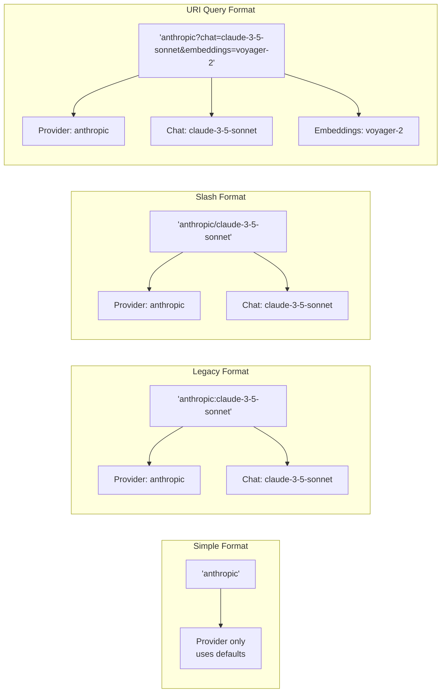
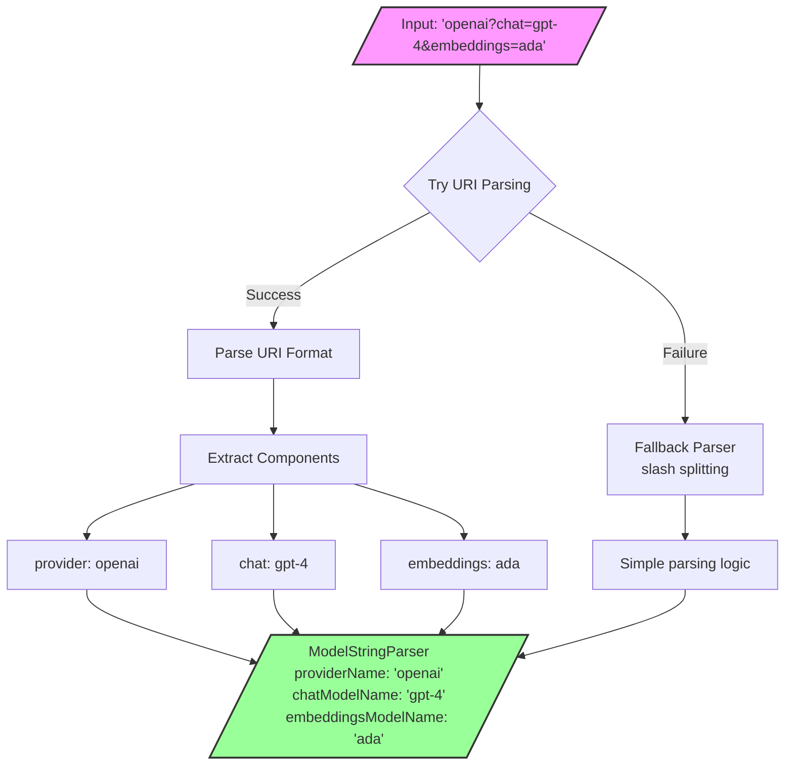
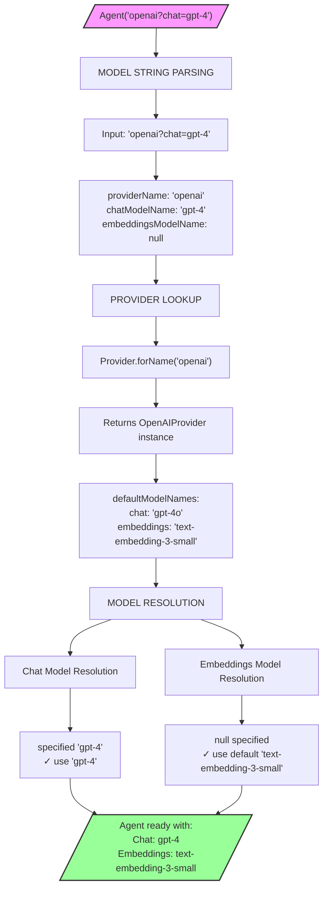
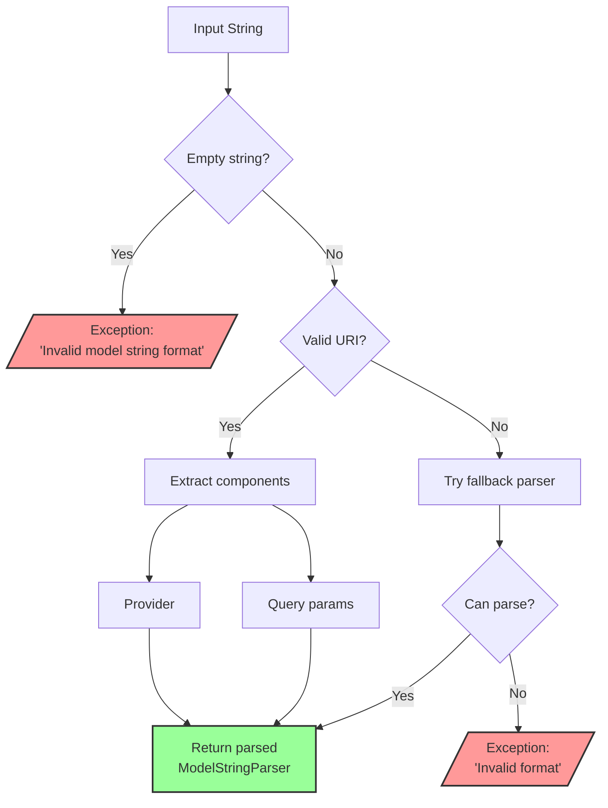

# Model Naming and String Format Specification

This document defines the model naming conventions and string parsing formats used in the langchain_compat (dartantic) package.

## Overview

The system supports flexible model specification through:
1. **Model String Parsing** - Multiple formats for specifying provider and model names
2. **Default Model Resolution** - How providers define and resolve default models
3. **Unified Naming Convention** - Consistent approach across all providers

## Model String Formats

The `ModelStringParser` class supports multiple formats for specifying models:

### Format Visual Guide



### Supported Formats

| Format | Example | Parsed Result |
|--------|---------|---------------|
| **Provider Only** | `anthropic` | Provider: `anthropic`, Chat: `null`, Embeddings: `null` |
| **Provider + Chat (colon)** | `anthropic:claude-3-5-sonnet` | Provider: `anthropic`, Chat: `claude-3-5-sonnet`, Embeddings: `null` |
| **Provider + Chat (slash)** | `anthropic/claude-3-5-sonnet` | Provider: `anthropic`, Chat: `claude-3-5-sonnet`, Embeddings: `null` |
| **URI Query Style** | `anthropic?chat=claude-3-5-sonnet` | Provider: `anthropic`, Chat: `claude-3-5-sonnet`, Embeddings: `null` |
| **Full URI Style** | `anthropic?chat=claude-3-5-sonnet&embeddings=voyager-2` | Provider: `anthropic`, Chat: `claude-3-5-sonnet`, Embeddings: `voyager-2` |

### Usage Examples

```dart
// All of these resolve to the same chat model
final agent1 = Agent('anthropic');
final agent2 = Agent('anthropic:claude-3-5-sonnet-20241022');
final agent3 = Agent('anthropic/claude-3-5-sonnet-20241022');
final agent4 = Agent('anthropic?chat=claude-3-5-sonnet-20241022');

// Specifying both chat and embeddings models
final agent5 = Agent('openai?chat=gpt-4o&embeddings=text-embedding-3-large');

// Provider only - uses defaults for both
final agent6 = Agent('google');
```

### Parsing Flow Diagram



### Parsing Rules

1. **URI Parsing Priority**: The parser first attempts to parse as a URI
   - Absolute URIs: `provider:model` format (colon becomes scheme separator)
   - Relative URIs: `provider`, `provider/model`, or `provider?params` formats
   
2. **Legacy Format Support**: If URI parsing fails, falls back to simple slash splitting

3. **Empty Values**: Empty model names are treated as `null`
   - `provider?chat=` results in `chatModelName: null`
   - `provider:` results in `chatModelName: null`

## Default Model Resolution

### Resolution Flow Diagram



### Provider-Level Defaults

Each provider defines default models using a `Map<ModelKind, String>` in their constructor. This allows different defaults for chat vs embeddings models. See provider implementations in `lib/src/providers/` for examples.

### Resolution Steps

1. **Agent Creation**: Parse model string to extract provider and model names
2. **Provider Lookup**: Find provider by name (case-insensitive, supports aliases)
3. **Model Resolution**: Use specified model name or fall back to provider's default for each ModelKind

### Current Provider Defaults

| Provider | Chat Default | Embeddings Default |
|----------|--------------|-------------------|
| OpenAI | `gpt-4o` | `text-embedding-3-small` |
| Anthropic | `claude-3-5-sonnet-20241022` | N/A |
| Google | `gemini-2.0-flash` | `models/text-embedding-004` |
| Mistral | `mistral-small` | `mistral-embed` |
| Cohere | `command-r-plus` | `embed-english-v3.0` |
| Ollama | `llama3.2` | N/A |
| OpenRouter | `google/gemini-2.0-flash` | N/A |
| Together | `meta-llama/Llama-3.2-3B-Instruct-Turbo` | N/A |

## Model String Builder

The `ModelStringParser` provides bidirectional conversion - it can parse model strings and also build them using `toString()`. 

### String Building Logic

```mermaid
stateDiagram-v2
    state "ModelStringParser State" as S1 {
        provider: openai
        chat: null
        embeddings: null
    }
    
    state "ModelStringParser State" as S2 {
        provider: openai
        chat: gpt-4
        embeddings: null
    }
    
    state "ModelStringParser State" as S3 {
        provider: openai
        chat: gpt-4
        embeddings: ada
    }
    
    S1 --> O1: toString()
    S2 --> O2: toString()
    S3 --> O3: toString()
    
    O1: "openai"
    O2: "openai:gpt-4"
    O3: "openai?chat=gpt-4&embeddings=ada"
    
    note right of O1: Provider only
    note right of O2: Colon format for chat
    note right of O3: Query format for multiple
```

The builder automatically selects the simplest format:
- Provider only if no models specified
- Colon format for chat model only  
- Query format for multiple model types

## Implementation Details

The `ModelStringParser` class (see `lib/src/agent/model_string_parser.dart`) handles:
- URI-based parsing with fallback for legacy formats
- Null handling for empty model names
- Reserved fields for future model types (otherModelName)
- String building that produces the simplest valid format

The Agent uses ModelStringParser internally to provide a computed `model` property that returns the fully qualified model string with defaults resolved.

## Design Principles

1. **Flexibility**: Support multiple intuitive formats for different use cases
2. **Backwards Compatibility**: Legacy `provider:model` format still works
3. **Extensibility**: URI query format allows future model types (e.g., `other`, `vision`)
4. **Simplicity**: Provider-only format uses sensible defaults
5. **Consistency**: All providers follow the same pattern

## Edge Cases and Validation

### Parsing Edge Cases Flowchart



### Valid Examples
- `openai` - Provider only, uses all defaults
- `openai:gpt-4` - Explicit chat model
- `openai/gpt-4` - Alternative syntax for chat model
- `openai?chat=gpt-4&embeddings=ada` - Explicit both models
- `google?embeddings=models/text-embedding-004` - Embeddings only

### Invalid Examples
- Empty string throws exception
- Multiple slashes in non-URI format throws exception
- Invalid URI format throws exception

### Resolution Examples

Key resolution behaviors:
- Providers without embeddings support throw `UnsupportedError` when embeddings methods are called
- Custom models override defaults only for specified types
- Agent.forProvider allows direct provider instance usage with optional model overrides

## Migration Guide

The new model string format maintains backward compatibility while adding flexibility:
- Legacy `provider:model` format still works
- New URI format enables multiple model specifications
- Unified Agent handles both chat and embeddings, eliminating separate configuration

See working examples in `example/bin/model_string.dart`.

## Summary

The model naming and string format system provides a flexible, extensible way to specify LLM configurations. The URI-style query format enables explicit control over multiple model types while maintaining backward compatibility with simpler formats. Combined with provider-level defaults, this creates an intuitive API that works well for both simple and complex use cases.
